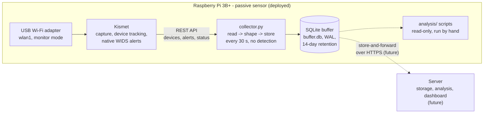

# Findings so far (thesis topic proposal)

Headline numbers measured on the running sensor, collated from the three
read-only analysis scripts in `analysis/`. Nothing here is recomputed: every
figure is copied from the script output of one run on **2026-09-19, 12:32-12:35
UTC**, over **3.9 days** of capture (2026-09-15 13:53 -> 2026-09-19 12:34 UTC).
Re-running the scripts later will shift the values as data accumulates.
Sections 1-4 predate the data gaps listed in section 6; any later re-run must
account for them (e.g. exclude the gap from coverage and rate figures).

| Script | Invocation |
|---|---|
| `analyze.py` | `python3 /opt/wifi-sensor/analysis/analyze.py --utc` |
| `rssi_stability.py` | `python3 /opt/wifi-sensor/analysis/rssi_stability.py --no-table` (defaults: >= 200 readings on >= 2 days) |
| `inventory_changes.py` | `python3 /opt/wifi-sensor/analysis/inventory_changes.py --protected IK-WIFI,FRI_wifi` (defaults: 24 h baseline, close = median RSSI >= -60 dBm) |

## 1. Dataset (`analyze.py`)

| | |
|---|---|
| Capture span | 3 d 22 h 39 m (3.94 days) |
| Polls | 11 210 total, 11 196 ok, 14 failed; **98.6 % coverage** at the 30 s interval |
| Gaps > 90 s | 3 (total 1 h 16 m, largest 1 h 02 m, on the first day) |
| Poll duration | avg 434 ms, max 4 467 ms |
| Devices ever seen | 28 546 (26 987 clients, 1 226 bridged, **312 APs**, 20 other, 1 ad-hoc) |
| Observations (RSSI time series) | 870 257 rows, ~223 000 per day |
| AP configuration changes | 20 209 history rows over 146 devices (almost all `adv_channel`/`ht_mode`/`beacon_rate` churn; `crypt` changed 36 times, `ssid` 239) |
| Kismet WIDS alerts | 19 (12 NOCLIENTMFP, 2 DEAUTHFLOOD, 1 BEACONRATE, 4 datasource open/error) |
| Probe requests | 20 476 client x SSID rows from 18 979 clients; 360 distinct named SSIDs |
| Buffer on disk | 152 MB, growing ~39 MB/day -> ~545 MB steady state at 14-day retention |

## 2. RSSI baseline stability (`rssi_stability.py`)

Across **106 fixed APs** with enough readings (>= 200 readings on >= 2 days;
690 131 readings):

| Metric (one value per AP) | Median | Q3 | p90 |
|---|---|---|---|
| RSSI standard deviation | **2.3 dB** | 3.3 dB | 5.2 dB |
| Robust sd (MAD-based) | 1.5 dB | 3.0 dB | 3.0 dB |
| Day-to-day range of the daily mean | 2.4 dB | 3.9 dB | 6.2 dB |

| APs whose RSSI sd is within | 2 dB | **3 dB** | **5 dB** | 8 dB |
|---|---|---|---|---|
| plain sd | 45 (42 %) | **71 (67 %)** | **92 (87 %)** | 102 (96 %) |
| robust sd | 65 (61 %) | 99 (93 %) | 99 (93 %) | 104 (98 %) |

- By band: 5 GHz is steadier (median sd 1.9 dB, 98 % of APs <= 5 dB) than
  2.4 GHz (median sd 2.5 dB, 80 % <= 5 dB).
- Drift vs. within-day noise: median day-to-day range of the mean / median
  robust sd = **1.61** - the script's own reading: a ratio well below ~2 means one
  static baseline per AP is adequate.
- Caveats (from the script): `rssi` is Kismet's `sig_last` (one frame per poll,
  not an average); readings exist only for polls in which the AP was active;
  phone hotspots that moved are not filtered beyond the min-days rule.

## 3. False-positive floor of a naive RSSI threshold (`rssi_stability.py`)

Baseline = median of the first 50 % of each AP's readings; evaluated on the
remaining **345 090 genuine readings** of the same 106 APs. The share of readings
a rule `|reading - baseline| > Y dB` would flag **with no attack present**:

| Y | Readings flagged (pooled) | Median AP | Worst AP | Excursions | Excursions lasting >= 3 obs. | APs never flagged |
|---|---|---|---|---|---|---|
| 3 dB | 23.99 % | 15.3 % | 71.6 % | 30 752 | 6 018 | 1 / 106 |
| 5 dB | 9.14 % | 2.6 % | 65.6 % | 14 394 | 2 323 | 3 / 106 |
| 6 dB | 5.79 % | 1.1 % | 64.4 % | 9 574 | 1 616 | 3 / 106 |
| 8 dB | 2.03 % | 0.28 % | 60.6 % | 4 855 | 393 | 14 / 106 |
| 10 dB | 0.97 % | 0.06 % | 59.0 % | 2 317 | 147 | 31 / 106 |
| 12 dB | 0.72 % | 0.01 % | 58.2 % | 1 602 | 128 | 53 / 106 |
| 15 dB | 0.63 % | 0.00 % | 56.9 % | 1 321 | 121 | 70 / 106 |
| 20 dB | 0.13 % | 0.00 % | 14.1 % | 359 | 17 | 81 / 106 |

- Size of genuine deviations: p50 2 dB, p90 5 dB, p95 7 dB, **p99 10 dB**,
  p99.9 22 dB, max 53 dB.
- A per-AP `3 x robust sigma` rule flags **8.06 %** of genuine readings
  (median threshold 4.4 dB).
- The worst-AP column is dominated by weak, far-away phone hotspots
  (baseline around -106 dBm, at the noise floor); the campus APs that make the top-10 list sit at 7-15 %
  beyond 8 dB.
- Conclusion the numbers support: a single fixed dB threshold on `sig_last` has
  a false-positive floor of roughly 1-2 % of readings even at 8-10 dB, and
  excursions of several consecutive observations are common - any RSSI-based
  detector needs per-AP baselines and persistence, not a global threshold.

## 4. AP inventory and impostor candidates (`inventory_changes.py`)

**312 AP devices** in 3 d 22 h (115 hidden SSID, 98 randomised BSSID).

| | Count | Transient | Intermediate | Sustained |
|---|---|---|---|---|
| APs first seen in the 24 h baseline window | 185 | 50 (27 %) | 2 (1 %) | 133 (72 %) |
| APs first seen after the baseline window | 127 | 101 (80 %) | 16 (13 %) | 10 (8 %) |

- Raw churn: **40 new APs per day** (mean over the 2 full post-baseline days),
  of which 84 % transient and 0.5/day sustained; 40-73 % of each post-baseline day's new
  BSSIDs are randomised (hotspots).
- Persistence x strength of the 127 newcomers: **0** in the "sustained + close
  (>= -60 dBm)" cell, the only population a stationary sensor could act on.
- Protected SSID `IK-WIFI`: 62 BSSIDs, all Ruckus Wireless (OUI `EC:58:EA` x60,
  `3C:46:A1` x2), **62 first seen in the baseline, 0 later**; flags raised:
  crypt x29, strong x14, oui x2, dropped x2.
- Protected SSID `FRI_wifi`: 2 BSSIDs (Routerboard), no flags.
- Look-alike SSIDs: none. (59 sustained APs have a hidden SSID and cannot be
  matched.)
- **Candidate list: 39** = 39 flagged protected-SSID BSSIDs + 0 look-alikes +
  0 sustained close newcomers; by class: sustained/far 38, transient/far 1.

Assessment (manual reading of the candidate table, not a script output): all 39
candidates are Ruckus BSSIDs of the campus infrastructure that were present in
the baseline window. The `crypt` flags come from the prefix `IK-WIFI` grouping
the open guest SSID with `IK-WIFI-DOT1X` (WPA2-EAP), and the `strong` flags are
simply the nearest APs of the same infrastructure. **No organic rogue AP occurred
in the capture** - so the inventory signal is clean, but it also cannot be
evaluated on real positives yet.

## 5. Architecture

## 6. Known data gaps

Windows in which the buffer has no usable polls. Exclude them from coverage,
rate and "never seen" statements, and do not schedule staged experiments into
them.

| From (UTC) | To (UTC) | Length | Cause |
|---|---|---|---|
| 2026-09-22 13:43:21 (last ok poll) | 2026-09-23 09:26:58 (first ok poll) | 19 h 44 m | Root filesystem full (Kismet logs) |

**2026-09-22 disk-full gap** (boundaries read from `polls` in the live buffer):

- Cause: 11 GB of kismetdb logs in `/var/lib/kismet` (79 files, 69 of them empty)
  filled the 15 GB root filesystem. Each file was ~93 % logged frames (~1.5 GB/day),
  which nothing on the sensor reads.
- Kismet's own log stopped growing at 12:19:57 (its writes failed first); the
  collector kept polling until 13:43:21, then there are no rows at all until
  20:01:57.
- 20:01:57-20:29:27: 56 failed polls (`ok = 0`, connection refused) while Kismet
  crash-looped every ~6 s, leaving one empty `.kismet` file per attempt.
- From 20:29 the collector itself crash-looped (>1500 restarts) on
  `sqlite3.OperationalError: disk I/O error` at `PRAGMA journal_mode=WAL` and
  wrote nothing until the disk was freed on 2026-09-23.
- No data loss before the gap: the buffer passed `PRAGMA quick_check` after WAL
  replay (a copy taken during the outage; opening the main file without its WAL
  showed it as malformed, so the `-wal` file must never be deleted by hand).
- Fixes (`install_sensor.sh`): no frame logging in kismetdb, idle-device expiry in
  Kismet's tracker, the kismetdb log retention timer, a journald size cap - see
  `CLAUDE.md`, "Disk-full incident".
