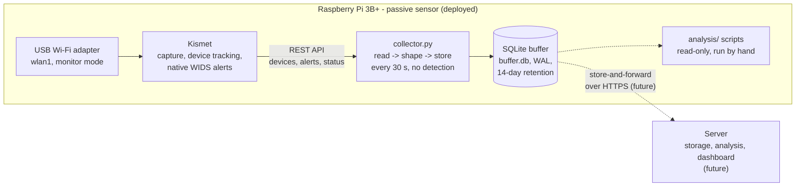

# Findings so far (thesis topic proposal)

Headline numbers measured on the running sensor, collated from the three
read-only analysis scripts in `analysis/`. Nothing here is recomputed: every
figure is copied from the script output of one run on **2026-09-19, 12:32-12:35
UTC**, over **3.9 days** of capture (2026-09-15 13:53 -> 2026-09-19 12:34 UTC).
Re-running the scripts later will shift the values as data accumulates.
Sections 1-4 predate the data gaps listed in section 6; any later re-run must
account for them (e.g. exclude the gap from coverage and rate figures).
Section 7 lists sensor configuration changes that alter what is captured (e.g.
the channel-hop list, 2026-09-26): compare per-channel figures only within one
configuration period. Section 8 is the probe-request feasibility study,
section 9 the channel-plan analysis and the capture-helper crash causes,
section 10 the first false-positive characterisation of the server-side
evil_twin detector, section 11 the data-quality rules that came out of it
(RSSI floor values, config-history churn, `freq_khz`). **The figures of
sections 1-3 and 10 treat the RSSI floor values -106/-120 dBm as signal
levels**; sections 2-3 were re-measured without them (2026-09-27, tables at
the end of each section) - the original text is kept, marked superseded.

| Script | Invocation |
|---|---|
| `analyze.py` | `python3 /opt/wifi-sensor/analysis/analyze.py --utc` |
| `rssi_stability.py` | `python3 /opt/wifi-sensor/analysis/rssi_stability.py --no-table` (defaults: >= 200 readings on >= 2 days) |
| `inventory_changes.py` | `python3 /opt/wifi-sensor/analysis/inventory_changes.py --protected IK-WIFI,FRI_wifi` (defaults: 24 h baseline, close = median RSSI >= -60 dBm) |

## 1. Dataset (`analyze.py`)

| | |
|---|---|
| Capture span | 3 d 22 h 39 m (3.94 days) |
| Polls | 11 210 total, 11 196 ok, 14 failed; **98.6 % coverage** at the 30 s interval |
| Gaps > 90 s | 3 (total 1 h 16 m, largest 1 h 02 m, on the first day) |
| Poll duration | avg 434 ms, max 4 467 ms |
| Devices ever seen | 28 546 (26 987 clients, 1 226 bridged, **312 APs**, 20 other, 1 ad-hoc) |
| Observations (RSSI time series) | 870 257 rows, ~223 000 per day |
| AP configuration changes | 20 209 history rows over 146 devices (almost all `adv_channel`/`ht_mode`/`beacon_rate` churn; `crypt` changed 36 times, `ssid` 239) |
| Kismet WIDS alerts | 19 (12 NOCLIENTMFP, 2 DEAUTHFLOOD, 1 BEACONRATE, 4 datasource open/error) |
| Probe requests | 20 476 client x SSID rows from 18 979 clients; 360 distinct named SSIDs |
| Buffer on disk | 152 MB, growing ~39 MB/day -> ~545 MB steady state at 14-day retention |

## 2. RSSI baseline stability (`rssi_stability.py`)

> **Superseded (floor values included).** The text and tables below count the
> RSSI floor values -106/-120 dBm as signal levels (section 11). Kept as
> published on 2026-09-19; the re-measurement is at the end of this section.

Across **106 fixed APs** with enough readings (>= 200 readings on >= 2 days;
690 131 readings):

| Metric (one value per AP) | Median | Q3 | p90 |
|---|---|---|---|
| RSSI standard deviation | **2.3 dB** | 3.3 dB | 5.2 dB |
| Robust sd (MAD-based) | 1.5 dB | 3.0 dB | 3.0 dB |
| Day-to-day range of the daily mean | 2.4 dB | 3.9 dB | 6.2 dB |

| APs whose RSSI sd is within | 2 dB | **3 dB** | **5 dB** | 8 dB |
|---|---|---|---|---|
| plain sd | 45 (42 %) | **71 (67 %)** | **92 (87 %)** | 102 (96 %) |
| robust sd | 65 (61 %) | 99 (93 %) | 99 (93 %) | 104 (98 %) |

- By band: 5 GHz is steadier (median sd 1.9 dB, 98 % of APs <= 5 dB) than
  2.4 GHz (median sd 2.5 dB, 80 % <= 5 dB).
- Drift vs. within-day noise: median day-to-day range of the mean / median
  robust sd = **1.61** - the script's own reading: a ratio well below ~2 means one
  static baseline per AP is adequate.
- Caveats (from the script): `rssi` is Kismet's `sig_last` (one frame per poll,
  not an average); readings exist only for polls in which the AP was active;
  phone hotspots that moved are not filtered beyond the min-days rule.

**Re-measurement without the floor values (2026-09-27)** - same window
(2026-09-15 -> 2026-09-19 12:34:00 UTC, `--until "2026-09-19 12:34"`), same
defaults, run on the Pi's buffer on 2026-09-27 18:44-18:46 UTC (before the
14-day retention reaches that window). Three runs:

- **old** = `--keep-floor`, the pre-2026-09-27 behaviour. It does **not**
  reproduce the published 106 APs / 690 131 readings: 99 APs / 681 756 readings,
  because 36 device keys that were APs in the window are now typed client or
  ad-hoc by Kismet (the script selects by the current `devices.type`). The
  per-AP distributions match the published ones to 0.1 dB, so this rerun is the
  like-for-like "old" column.
- **floors excluded** = the new default: -106/-120 are censored readings, left
  out of every statistic (section 11).
- **eligible (f <= 0.35)** = floors excluded and APs whose floor share exceeds
  0.35 removed (`--max-floor-share 0.35`, the evil_twin eligibility rule of
  section 11). Keeps the censoring bias of the middle column visible: an AP
  with many floor readings gets an upward-biased median there.

| Metric | old (floors as levels) | floors excluded | eligible (f <= 0.35) |
|---|---|---|---|
| Qualifying APs / readings | 99 / 681 756 | 95 / 675 180 | 92 / 673 768 |
| Floor readings in the window (all APs) | 7 528 counted as levels | 7 528 excluded | 7 528 excluded |
| Floor share per qualifying AP | - | median 0, p90 0, max 0.939; > 0.01: 6 APs, > 0.35: 3 | max 0.267 |
| RSSI sd per AP: median / Q3 / p90 / max | 2.3 / 3.3 / 5.2 / 10.0 dB | 2.4 / 3.3 / 5.0 / 7.0 dB | 2.2 / 3.3 / **3.7** / 7.0 dB |
| Robust sd: min / median / Q3 | **0.0** / 1.5 / 3.0 dB | 1.5 / 1.5 / 3.0 dB | 1.5 / 1.5 / 3.0 dB |
| APs with sd <= 3 dB / <= 5 dB | 67 (68 %) / 86 (87 %) | 65 (68 %) / 84 (88 %) | 65 (71 %) / 84 (91 %) |
| 2.4 GHz: APs, median sd, sd <= 5 dB | 60, 2.6, 78 % | 56, 2.6, 80 % | 53, 2.6, 85 % |
| 5 GHz: APs, median sd, sd <= 5 dB | 39, 1.8, 100 % | 39, 1.8, 100 % | 39, 1.8, 100 % |
| Day-to-day range of the daily mean: median / p90 / max | 2.4 / 6.2 / 18.9 dB | 2.3 / 5.9 / 10.1 dB | 2.4 / 5.9 / 10.1 dB |
| Drift ratio (range of daily means / robust sd) | 1.62 | 1.58 | 1.59 |

What changes: the robust sd of 0.0 dB disappears (it belonged to APs whose
readings were mostly the floor, i.e. no measurement at all), the worst per-AP
sd and day-to-day range shrink (10.0 -> 7.0 dB, 18.9 -> 10.1 dB), and once the
heavily censored APs are removed the p90 sd drops from 5.0 to 3.7 dB. The
medians and the headline ("median sd ~2.3 dB, one static baseline per AP is
adequate") do not change.

## 3. False-positive floor of a naive RSSI threshold (`rssi_stability.py`)

> **Superseded (floor values included).** As section 2: kept as published on
> 2026-09-19, re-measurement at the end of this section.

Baseline = median of the first 50 % of each AP's readings; evaluated on the
remaining **345 090 genuine readings** of the same 106 APs. The share of readings
a rule `|reading - baseline| > Y dB` would flag **with no attack present**:

| Y | Readings flagged (pooled) | Median AP | Worst AP | Excursions | Excursions lasting >= 3 obs. | APs never flagged |
|---|---|---|---|---|---|---|
| 3 dB | 23.99 % | 15.3 % | 71.6 % | 30 752 | 6 018 | 1 / 106 |
| 5 dB | 9.14 % | 2.6 % | 65.6 % | 14 394 | 2 323 | 3 / 106 |
| 6 dB | 5.79 % | 1.1 % | 64.4 % | 9 574 | 1 616 | 3 / 106 |
| 8 dB | 2.03 % | 0.28 % | 60.6 % | 4 855 | 393 | 14 / 106 |
| 10 dB | 0.97 % | 0.06 % | 59.0 % | 2 317 | 147 | 31 / 106 |
| 12 dB | 0.72 % | 0.01 % | 58.2 % | 1 602 | 128 | 53 / 106 |
| 15 dB | 0.63 % | 0.00 % | 56.9 % | 1 321 | 121 | 70 / 106 |
| 20 dB | 0.13 % | 0.00 % | 14.1 % | 359 | 17 | 81 / 106 |

- Size of genuine deviations: p50 2 dB, p90 5 dB, p95 7 dB, **p99 10 dB**,
  p99.9 22 dB, max 53 dB.
- A per-AP `3 x robust sigma` rule flags **8.06 %** of genuine readings
  (median threshold 4.4 dB).
- The worst-AP column is dominated by weak, far-away phone hotspots
  (baseline around -106 dBm, at the noise floor); the campus APs that make the top-10 list sit at 7-15 %
  beyond 8 dB.
- Conclusion the numbers support: a single fixed dB threshold on `sig_last` has
  a false-positive floor of roughly 1-2 % of readings even at 8-10 dB, and
  excursions of several consecutive observations are common - any RSSI-based
  detector needs per-AP baselines and persistence, not a global threshold.

**Re-measurement without the floor values (2026-09-27)** - the same three runs
as in section 2 (old = floors as levels, rerun; floors excluded; eligible =
floors excluded and floor share <= 0.35). Test readings: 340 901 / 337 610 /
336 903. Cells: readings flagged (pooled) / worst AP / excursions lasting
>= 3 observations.

| Y | old (floors as levels) | floors excluded | eligible (f <= 0.35) |
|---|---|---|---|
| 3 dB | 24.128 % / 71.6 % / 5 970 | 24.131 % / 66.9 % / 5 917 | 24.073 % / 65.1 % / 5 877 |
| 5 dB | 9.202 % / 65.6 % / 2 311 | 9.038 % / 43.7 % / 2 241 | 8.985 % / 43.7 % / 2 212 |
| 6 dB | 5.825 % / 64.4 % / 1 609 | 5.608 % / 32.5 % / 1 531 | 5.572 % / 32.5 % / 1 514 |
| 8 dB | 2.047 % / 60.6 % / 393 | **1.797 %** / 29.4 % / 315 | **1.763 %** / 29.4 % / 302 |
| 10 dB | 0.975 % / 59.0 % / 147 | **0.712 %** / 27.0 % / 65 | **0.685 %** / 27.0 % / 57 |
| 12 dB | 0.727 % / 58.2 % / 128 | 0.456 % / 23.8 % / 43 | 0.439 % / 23.8 % / 40 |
| 15 dB | 0.632 % / 56.9 % / 121 | 0.354 % / 19.8 % / 35 | 0.349 % / 19.8 % / 35 |
| 20 dB | 0.132 % / 14.1 % / 17 | 0.078 % / 1.0 % / 4 | 0.078 % / 1.0 % / 4 |

| | old | floors excluded | eligible (f <= 0.35) |
|---|---|---|---|
| \|deviation\| p99 / p99.9 / max | 10 / 22 / 53 dB | 9 / 20 / 44 dB | 9 / 20 / 44 dB |
| Stronger / weaker readings beyond 15 dB | **797** / 1 358 | **9** / 1 186 | 9 / 1 167 |
| Longest excursion beyond 8 dB | 128 observations | 30 | 30 |
| APs never flagged at 8 / 10 dB | 12 / 26 of 99 | 11 / 25 of 95 | 11 / 25 of 92 |
| Per-AP 3 x robust sigma rule | 8.107 % | 8.162 % | 8.156 % |

What changes: at 10-15 dB the pooled false-positive share falls by roughly a
quarter to a half and the persistent excursions (>= 3 observations) by 55-71 %;
beyond 15 dB almost nothing is "stronger" any more (797 -> 9) - those were
real readings of weak APs measured against a baseline sitting on the floor.
What stays: at 3-6 dB the figures barely move, the 3-sigma rule still flags
~8 %, and the worst AP still exceeds 8 dB in ~29 % of its readings (a
randomised-BSSID phone hotspot; the campus APs are unchanged at 5-10 %). The
conclusion of this section holds, with a lower floor: ~1.8 % of genuine
readings beyond 8 dB and ~0.7 % beyond 10 dB, before any persistence rule.

## 4. AP inventory and impostor candidates (`inventory_changes.py`)

**312 AP devices** in 3 d 22 h (115 hidden SSID, 98 randomised BSSID).

| | Count | Transient | Intermediate | Sustained |
|---|---|---|---|---|
| APs first seen in the 24 h baseline window | 185 | 50 (27 %) | 2 (1 %) | 133 (72 %) |
| APs first seen after the baseline window | 127 | 101 (80 %) | 16 (13 %) | 10 (8 %) |

- Raw churn: **40 new APs per day** (mean over the 2 full post-baseline days),
  of which 84 % transient and 0.5/day sustained; 40-73 % of each post-baseline day's new
  BSSIDs are randomised (hotspots).
- Persistence x strength of the 127 newcomers: **0** in the "sustained + close
  (>= -60 dBm)" cell, the only population a stationary sensor could act on.
- Protected SSID `IK-WIFI`: 62 BSSIDs, all Ruckus Wireless (OUI `EC:58:EA` x60,
  `3C:46:A1` x2), **62 first seen in the baseline, 0 later**; flags raised:
  crypt x29, strong x14, oui x2, dropped x2.
- Protected SSID `FRI_wifi`: 2 BSSIDs (Routerboard), no flags.
- Look-alike SSIDs: none. (59 sustained APs have a hidden SSID and cannot be
  matched.)
- **Candidate list: 39** = 39 flagged protected-SSID BSSIDs + 0 look-alikes +
  0 sustained close newcomers; by class: sustained/far 38, transient/far 1.

Assessment (manual reading of the candidate table, not a script output): all 39
candidates are Ruckus BSSIDs of the campus infrastructure that were present in
the baseline window. The `crypt` flags come from the prefix `IK-WIFI` grouping
the open guest SSID with `IK-WIFI-DOT1X` (WPA2-EAP), and the `strong` flags are
simply the nearest APs of the same infrastructure. **No organic rogue AP occurred
in the capture** - so the inventory signal is clean, but it also cannot be
evaluated on real positives yet.

## 5. Architecture

```mermaid
flowchart LR
    subgraph pi["Raspberry Pi 3B+ - passive sensor (deployed)"]
        adapter["USB Wi-Fi adapter<br/>wlan1, monitor mode"]
        kismet["Kismet<br/>capture, device tracking,<br/>native WIDS alerts"]
        collector["collector.py<br/>read -> shape -> store<br/>every 30 s, no detection"]
        buffer[("SQLite buffer<br/>buffer.db, WAL,<br/>14-day retention")]
        analysis["analysis/ scripts<br/>read-only, run by hand"]
        adapter --> kismet
        kismet -- "REST API<br/>devices, alerts, status" --> collector
        collector --> buffer
        buffer -.-> analysis
    end
    server["Server<br/>storage, analysis, dashboard<br/>(future)"]
    buffer -. "store-and-forward<br/>over HTTPS (future)" .-> server
```

## 6. Known data gaps

Windows in which the buffer has no usable polls, or in which polls succeeded
but the capture delivered no frames (Kismet's packet counter frozen). Exclude
them from coverage, rate and "never seen" statements, and do not schedule staged
experiments into them. Windows with reduced channel coverage (but frames) are
in section 7.

| From (UTC) | To (UTC) | Length | Cause |
|---|---|---|---|
| 2026-09-17 19:36:17 (last ok poll) | 2026-09-17 19:38:27 (next ok poll) | 2 m 10 s | Not investigated (found in the server's `polls` on 2026-09-27) |
| 2026-09-17 21:37:57 (last ok poll) | 2026-09-17 21:49:50 (next ok poll) | 11 m 53 s | Not investigated (server `polls`) |
| 2026-09-19 12:18:01 (last ok poll) | 2026-09-19 12:25:01 (next ok poll) | 7 m | Not investigated (server `polls`) |
| 2026-09-21 16:26:28 (last ok poll) | 2026-09-21 21:47:58 (next ok poll) | 5 h 21 m | Hung Kismet after a glibc heap abort (`CLAUDE.md`, "Hung-server incident"); stop blocked by `TimeoutStopSec=infinity` |
| 2026-09-22 13:43:21 (last ok poll) | 2026-09-23 09:26:58 (first ok poll) | 19 h 44 m | Root filesystem full (Kismet logs) |
| 2026-09-26 22:46:43 (last ok poll) | 2026-09-26 22:48:23 (first ok poll) | 1 m 40 s | Controlled reboot after the hop-list/journal install (`sudo reboot` 22:46:55, Kismet up 22:47:52; one failed poll at 22:47:53) |
| 2026-09-27 11:30:14 (source "re-opened" after a capture-helper crash; counter frozen from the 11:29:54 poll) | 2026-09-27 11:34:25 (watchdog restarted Kismet; frames again at the 11:34:54 poll) | ~4 m | Polls ok, no frames: helper crashes at 11:29:37 and 11:30:07, Kismet's re-open with the broken definition (section 7) captured nothing until the watchdog's second strike |
| 2026-09-27 12:17:20 (helper crash; counter frozen from the 12:17:24 poll) | 2026-09-27 12:22:55 (watchdog restarted Kismet; frames again at the 12:23:24 poll) | ~5.5 m | Same: helper crashes at 12:17:20/39/47, re-open captured nothing |

**2026-09-22 disk-full gap** (boundaries read from `polls` in the live buffer):

- Cause: 11 GB of kismetdb logs in `/var/lib/kismet` (79 files, 69 of them empty)
  filled the 15 GB root filesystem. Each file was ~93 % logged frames (~1.5 GB/day),
  which nothing on the sensor reads.
- Kismet's own log stopped growing at 12:19:57 (its writes failed first); the
  collector kept polling until 13:43:21, then there are no rows at all until
  20:01:57.
- 20:01:57-20:29:27: 56 failed polls (`ok = 0`, connection refused) while Kismet
  crash-looped every ~6 s, leaving one empty `.kismet` file per attempt.
- From 20:29 the collector itself crash-looped (>1500 restarts) on
  `sqlite3.OperationalError: disk I/O error` at `PRAGMA journal_mode=WAL` and
  wrote nothing until the disk was freed on 2026-09-23.
- No data loss before the gap: the buffer passed `PRAGMA quick_check` after WAL
  replay (a copy taken during the outage; opening the main file without its WAL
  showed it as malformed, so the `-wal` file must never be deleted by hand).
- Fixes (`install_sensor.sh`): no frame logging in kismetdb, idle-device expiry in
  Kismet's tracker, the kismetdb log retention timer, a journald size cap - see
  `CLAUDE.md`, "Disk-full incident".

## 7. Sensor configuration changes (dataset boundaries)

Changes to the sensor that alter what is captured. Figures that depend on the
channel coverage (per-channel counts, probe rates, "never seen on channel X")
must not be compared across these boundaries without saying so. Times are UTC,
read from the running system after the change (journal, `polls`), not planned.

| Effective from (UTC) | Change | Effect on the data |
|---|---|---|
| 2026-09-26 22:45:26 | Hop list: explicit `channels=` list, Kismet's autodetected 91-entry list without `165HT40-` (90 entries, same order, shuffled at 5 hops/s). `install_sensor.sh` restarted Kismet at 22:45:25-26; last poll on the old list 22:45:13, first on the new list 22:45:43 | rtw88 WARN storm over (last WARN 22:45:22; 0 since); the 721 ms stall per cycle is gone (dwell median 0.215 s, max 0.223 s). **But only 45 of the 90 entries were visited, until 2026-09-27 13:04:57** (stride 4 vs length 90, see below): **WIDS and any probe data from 2026-09-26 22:45:26 to 2026-09-27 13:04:57 saw half the channel list** - and most of that window even less (next row) |
| 2026-09-26 23:09:14 - 2026-09-27 11:34:24, and 2026-09-27 12:17:20 - 12:22:55 | **Hop list collapsed to channel 1** after capture-helper crashes ("IPC connection closed" at 23:09:14, 23:29:21, 23:54:22, 00:11:05, 11:29:37, 11:30:07, 12:17:20/39/47). Kismet 2025-09 re-opens a failed source from a definition it rebuilds without quoting (`kis_datasource.cc`, `generate_source_definition()`), so `channels="1,1HT40+,..."` became `channels=1` plus stray options; the re-opened source hopped `['1']` (saved datasource state of both Kismet runs; the first reboot-to-11:34 run logged 6 retries, the 11:34-12:22 run 3). Ended only by the watchdog's Kismet restarts (stuck counter after the later crashes) | **Only 2412 MHz received for ~12 h 25 min overnight and ~5 min at noon**: from the 23:10 10-minute bin to 11:20 every observation in the buffer is on 2412 MHz (a few 2417-2457 MHz values until 23:40 from adjacent-channel reception), no 5 GHz at all; the frame rate stayed normal, so the watchdog did not notice. Treat these windows as channel-1-only data. Plus no frames at all 11:30:14-11:34:25 and 12:17:20-12:22:55 (section 6). Caused by the explicit `channels=` list of 22:45:26 - with Kismet's autodetected list (no commas in the definition) a re-open kept the full list |
| 2026-09-27 13:04:57 | Hop list: 89 entries (also without `140HT40-`, 136+140 is not an 802.11 40 MHz channel; same order otherwise), stride check in the installer. `install_sensor.sh` restarted Kismet 13:04:56-57; last poll on the 90-entry list 13:04:54, first on the 89-entry list 13:05:24 | Full coverage again: all **89** distinct settings visited (`dwell_poll.py`, 90 s at ~13:21), stride 4, gcd(89, 4) = 1; dwell median 0.215 s, max 0.222 s; cycle ~19.1 s; 2.4 GHz time share 19.5 %; 0 WARNs. **Still exposed to the channel-1 collapse at the next helper crash** (open item in `CLAUDE.md`) - check future data for 2412-only stretches |
| 2026-09-27 13:04:57 | Kismet web UI / REST API bound to 127.0.0.1 (`httpd_bind_address`; was 0.0.0.0 on every interface). The existing web UI login was **kept** (unique password, not reused elsewhere; now reachable only on loopback / through an SSH tunnel) | None on the captured data (the collector already used 127.0.0.1; polls continued) |
| 2026-09-27 14:15:50 | Hop guard deployed (`wifi-sensor-hop-guard.service` started 14:15:50, guarding the 89-entry list); collector with buffer v4 restarted 14:15:56, first poll with `polls.ds_hop_*` 14:15:57. Kismet not restarted (up since 13:04:57). Recorded 2026-09-27 ~19:40 from the journal and `polls` | A capture-helper crash still collapses the live list to channel 1, but only until the guard's next check: crashes 14:16:41, 14:19:30 and 18:42:26 (the last one with a USB disconnect) were re-applied at 14:16:50, 14:19:40 and 18:42:34 ("live 1 entries -> 89"), so **<= ~10 s of channel-1-only data per crash** instead of hours. `ds_hop_ok` = 0 on 1 of 624 polls up to ~19:28 (18:42:27, source not running). From 14:15:57 every poll records the live hop-list length, the visited entries and whether the list is the configured one - later degraded windows can be read from `polls` instead of reconstructed |
| 2026-09-27 19:57:29 | Collector with buffer schema v5 (`install_collector.sh`, commit `8b76e3c`; section 11): collector stopped 19:57:28 and started 19:57:29, migration v4 -> v5 logged 19:57:30; last poll on v4 19:57:27, first on v5 19:57:30 (ok). Kismet and the hop guard not restarted, no capture gap | **RSSI floor values -106/-120 are stored as NULL** in `rssi`/`rssi_min`/`rssi_max` with `rssi_floor = 1` (first flagged row 19:58:00): 0 raw floor values in the first 53 min against 156 in the 53 min before; 92 flagged. **AP configuration merged field-wise**: `device_config_history` 47.5 rows/h in the first 53 min against 540/h just before and 269/h in the same hours of the previous day; 41 of the 42 rows are real advertised-channel changes, 1 is an AP's first beacon record (`crypt_bits` stored as 0 before it, then the real value). Rows before this time keep raw floors and the churn; readers apply the section 11 rules |
| 2026-10-03 11:00:20 | Collector with buffer schema v6 (`install_collector.sh`, commit `f647c8f`): slim observations - only `ts`, `key`, `last_time`, `rssi`/`rssi_floor`, `pk_total`, `pk_data`, `disconnects`, `disconnects_last`, `bss_timestamp` written; AP load (`n_clients`, `qbss_stations`, `util_pct`) moved to `devices.cur_*` as the latest value; a client's BSSID to `client_bssids`; Kismet's device channel/frequency, min/max signal, tx/rx packets, data size, IE checksum and beacon fingerprint no longer requested. Collector stopping 11:00:16, stopped/started 11:00:19, "migrating buffer schema v5 -> v6" logged 11:00:20; last poll on v5 11:00:02, first poll on v6 11:00:20 (ok; one 18 s poll interval, no gap). Kismet and the hop guard not restarted. Recorded 2026-10-03 ~11:25 from the journal and `polls` | Nothing about what is captured (Kismet and the hop list unchanged). Checked ~11:25: in the 3,532 rows written since 11:00:20 every dropped column is NULL and the kept ones are filled; 77 APs carry `cur_*`, `client_bssids` holds 121 pairs. From the effective time the dropped observation columns are NULL in new rows (older rows keep their values until the 14-day retention removes them), the per-poll AP load history (client count, QBSS stations, channel utilisation) is no longer kept - only its latest value per AP -, and a client's BSSID is a first/last pair instead of a per-poll value. `observations.freq_khz` (which was never the reception channel) is gone: per-band figures from then on use `devices.adv_channel` |
| 2026-09-26 ~22:40 | Journal persistent (`journalctl --flush` during the install; the oldest entry kept from that boot is 22:40:39) | Kernel, Kismet and collector logs survive reboots (200 MB cap). Earlier incidents have only ~4 min of journal. Each boot's first lines carry the stale clock (e.g. 2026-09-15 13:53) until chrony syncs - the pre-start logs "clock synchronised" at that point |

**Hop coverage before and after 22:45:26** (measured with
`analysis/probe_study/dwell_poll.py`):

| | Before (2026-09-26 ~22:20, 90 s) | 90 entries (~22:52, 90 s; 22:59, 20 s) | 89 entries (2026-09-27 ~13:21, 90 s) |
|---|---|---|---|
| Hop-list entries | 91 | 90 | 89 |
| Distinct settings visited | 91 | **45** (every other list position) | 89 |
| Dwell per hop | median 0.215 s; `165HT40-` 0.721 s | median 0.215 s, max 0.223 s | median 0.215 s, max 0.222 s |
| Full cycle | ~20.1 s | ~9.7 s (45 x 0.215 s) | ~19.1 s |
| 2.4 GHz time share | 18.2 % | 19.7 % (20 s sample) | 19.5 % |
| Channel 165 airtime | ~4.6 % (165 + 165HT40-, incl. stall) | 0 % (`165` is not visited) | ~1.1 % (`165` only) |

Why only half: the capture helper steps through the (shuffled) list with a fixed
stride that Kismet 2025-09 derives from the list length alone - the Linux Wi-Fi
helper prefers 4 (`capture_linux_wifi.c`) and `cf_handler_assign_hop_channels`
(`capture_framework.c`) keeps the first s >= 4 with `N % (N / s) != 0`, which is
not a coprimality test. For N = 91 that is 4, coprime with 91 (all visited, by
luck); for N = 90 it is also 4, gcd(90, 4) = 2, so only even list positions are
tuned.
Not visited since 22:45:26: 2.4 GHz `1HT40+`, 3, 5, `6HT40-`, 7, 9, 11 (20 MHz;
11 is still the primary of `11HT40-`), 12; on 5 GHz every odd position (e.g. 36,
`36VHT80`, `40HT40-`, 44, `44VHT80`, ..., 165). Adjacent-channel reception on
2.4 GHz still hears some frames of the skipped channels. This period ended at
2026-09-27 13:04:57 (89-entry list, row above); most of it was channel-1-only
anyway (row "Hop list collapsed"). No channel reweighting was done - that is a
separate, later decision for the probe study.

## 8. Probe-request feasibility study (2026-09-26)

Question: can this sensor (Pi 3B+, one RTL8821CU on `rtw88_8821cu`, Kismet
2025-09-R1, channel hopping) passively fingerprint Wi-Fi clients and re-link
probe-request bursts of devices that randomise their MAC, from frame features
(probe-request IEs, 802.11 sequence numbers, timing, RSSI)? Scripts:
`analysis/probe_study/`. Sample: **2026-09-26 22:01-22:16 UTC (Saturday night)**,
15 min on the old 91-entry hop list (before section 7): 53,232 frames,
**355 probe requests from 157 MACs**. All captures lived in tmpfs on the Pi and
were deleted; MACs/SSIDs were only handled as keyed hashes with a per-run key;
everything below is aggregate. **Night-time, one location, 15 minutes: repeat at
the daytime peak before drawing conclusions.**

### Capture paths (verified in the 2025-09-R1 source and live)

| Path | Result |
|---|---|
| REST pcapng stream `GET /datasource/pcap/by-uuid/<uuid>/packets.pcapng` (`datasourcetracker.cc`), also `/pcap/all_packets.pcapng` | **Used.** Read-only role, basic auth. Full frames, linktype 127 (radiotap). Filterable only per datasource, device key or BSSID - not by frame type, so every frame is streamed (probe requests were 0.67 %). Fed at the packet-chain logging stage; drops silently when its 512 KB backlog is full (no counter) |
| Eventbus websocket `/eventbus/events` | Nothing per frame: `NEW_DEVICE`, `DOT11_NEW_PROBED_SSID` (once per new device+SSID), `PACKETCHAIN_STATS`, `ALERT`, `DATASOURCE_*`, `TIMESTAMP`, `MESSAGE`. `/devices/monitor` is per device |
| Direct capture beside Kismet on `wlan1mon` | Needs root: no tcpdump/tshark/dumpcap/scapy installed, the sensor user has no capabilities (only `kismet_cap_linux_wifi` has `cap_net_admin,cap_net_raw`) |
| Kismet's `dot11.device.probe_fingerprint` | Per MAC, last value only (Adler-32 over IEs 1, 50, 59, 107, 127, two vendor IEs) - useless across randomised MACs |

**Cross-check, Kismet stream vs raw socket** (`raw_vs_kismet.py`, run by the
developer with sudo on 2026-09-26 at night, before the hop-list change at
22:44): 5 min, **58/58 probe requests on both** the raw AF_PACKET socket (kernel
BPF filter) and the Kismet stream, **0 kernel drops** on the raw socket. CPU:
Kismet-stream thread ~2.68 s vs raw-socket thread 0.09 s over 300 s (the stream
parses every frame; the BPF passes only probe requests). The 15-min sample's
stream delivered ~98 % of the frames the datasource counter advanced by in the
same window (a 60 s re-run on 2026-09-26 23:00: 98.6 %); the 58/58 result shows
that this gap did not cost probe requests in that window.

### Feature availability

| Feature | Status | Evidence |
|---|---|---|
| Full probe frames + radiotap without root | Available | REST stream, 100 % of frames with radiotap |
| dBm signal | Available | 2 fields per frame (combined + antenna 0); median -67 dBm, p10/p90 -92/-46 |
| TSFT | Available | 100 % of frames, monotonic, all distinct |
| Channel, Flags, Rate, RX flags | Available | Flags always 0x10 (FCS appended); no MCS/VHT/HE fields (probes use legacy rates) |
| Bad-FCS / drop visibility | Partial | FCS-failed frames are dropped in the kernel (`fcsfail` off): 0 bad frames seen. Stream has no drop counter; `wlan1mon`: 5 of 443k dropped, 0 transmitted |
| True transmit channel | Partial | Radiotap gives the tuned channel. On 2.4 GHz 58 % of probes with a DS Parameter IE were heard from another channel (off by 1: 96, same: 79); the DS Parameter IE is in only 54 % of frames |
| IE set/order fingerprint | Partial (low entropy) | 67 content fingerprints over frames, 38 over MACs; 3.3 bits over MACs (max possible 7.3); randomised MACs only 2.9 bits, largest group 54 % of them. Rate IEs differ by band, so fingerprints must be per band |
| Sequence number within a MAC | Available | consecutive frames: 126 +1..16, 38 +17..256, 26 larger, 8 backwards |
| Sequence number across a MAC change | Not available | first seq of new randomised MACs uniform (median 2151; 8 < 256 vs 9.2 by chance); nearest same-fingerprint successor within 10 s: 0 of 82 within +64 (1.3 by chance) - reset/randomised on MAC change |
| Directed vs wildcard | Available, strong linker | 217 directed, 138 wildcard, 10 distinct SSIDs; 96 of 147 randomised MACs sent directed probes |
| Burst structure | Partial | 214 bursts: 72 % one frame, 88 % on one channel; 118 of 157 MACs seen once |
| WPS UUID-E | Absent | 0 frames |

Example: 91 randomised MACs (106 frames, 2.4 GHz only, median -50 dBm) share one
IE fingerprint and one directed SSID (89 % of their frames) - almost certainly
one nearby device changing its MAC on every scan and trivially re-linkable.

### Rates and coverage

- 24.1 probe requests/min (5-52 per minute), 14.5 bursts/min; 93.6 % of MACs
  but 65.9 % of frames randomised; 10 global MACs sent 34 % of frames.
- Collector buffer, 2026-09-23..25 (`buffer_hourly.py`): ~6,500 new probing
  MACs/day, 99.6 % randomised, most at 00-04 UTC - MAC-per-scan devices, not
  people. (09-23 starts at 09:27 after the disk-full gap.)
- Hop list then: 91 entries at 5/s, dwell 0.215 s, cycle ~20 s. Time share vs
  probe yield: 2.4 GHz 18.2 % of listen time -> 63 % of probes (partly
  off-channel); 5 GHz 36-48 13.2 % -> 9.6 %; DFS 52-144 52.7 % -> 13.5 %;
  149-165 15.4 % -> 13.5 %.
- A phone scan visits each channel for tens of ms; estimated chance of catching
  a given scan ~0.3-0.45 (not measured), usually with one frame. Continuous
  multi-day observation compensates - the planned ablation (continuous vs
  one-shot) rests on this.

### Cost on the Pi (15-min sample)

Kismet 7.6 % of one core while streaming (5.9 % lifetime average, +1.7 points),
RSS +1 MB; the consumer 0.7 % and 10 MB; loopback stream ~10 KB/s; system 5.9 %
of 4 cores. Storage: raw probe frames average 179 B (~6 MB/day at the night
rate); compact per-probe records ~2-3 MB/day; budget <= 10 MB/day for peaks.

### Risks

1. Most randomised MACs send one frame - fingerprints from 1-2 frames.
2. Sequence-number linkage is not available on this population.
3. Low IE entropy (~3 bits): linkage has to rest on directed SSIDs, RSSI and
   timing; daytime samples may spread the classes.
4. Hopping misses most scan bursts; capture-helper restarts (~13/day before the
   storm fix) add gaps, and with an explicit hop list each one currently pins the
   sensor to channel 1 until Kismet restarts (section 7; 2026-09-26 22:45 -
   2026-09-27 13:05 also had only half the channels).
5. Weak sample (15 min, night, one site, dominated by one device).
6. Data protection: keyed hashes are still pseudonymous personal data and
   directed SSIDs are sensitive - an ethics/GDPR note is needed.

## 9. Channel plan analysis (2026-09-27) - analysis only, no config change

Question: the detectors (deauth_flood, evil_twin) and the probe study need
management frames, which are sent at 20 MHz on the primary channel. Would a
20 MHz-only hop list, or dropping DFS channels without APs, lose anything, and
what would it gain in revisit time? Nothing was changed on the sensor.

**Wide dwells hear management frames only on their primary channel.** 150 s on
2026-09-27 ~13:40 UTC, the tuned setting from `iw` polling matched to 5,448
frames of the Kismet stream: in 40 MHz dwells 371 of 392 beacons were on the
primary channel, in 80 MHz dwells 331 of 339, and **0 beacons on a secondary
20 MHz subchannel**. The remaining ~5 % of frames at +-20-60 MHz occur just as
often in plain 20 MHz dwells, i.e. frames attributed to the wrong dwell by the
timestamp lag at hop boundaries. So for beacons, probe requests/responses and
deauths an HT40/VHT80 hop entry is simply another visit to its primary channel.

**What a 20 MHz-only list would lose:** data (and wide control) frames of 40/80 MHz
BSSs - 90 of the 385 APs with a known HT mode (HT40+-: 16, HT80: 74; mostly 5 GHz,
e.g. 30 APs on 44/HT80, plus ~11 HT40 APs on 2.4 GHz). That changes `pk_data`,
client inference from data frames, and the evil_twin RSSI series
(`observations.rssi` = Kismet `sig_last`, the last frame of any type): for wide
5 GHz APs it would become beacon-only - a baseline boundary that needs
re-baselining.

**AP inventory by primary channel** (569 APs first seen before 2026-09-26 22:45,
i.e. with the full 91-entry list; 152 sustained = >= 100 observations):

| Band | APs (sustained) | Notes |
|---|---|---|
| 2.4 GHz | 302 (79) | busiest primaries 6 (99), 1 (74), 11 (31); every channel 1-13 in use |
| 5 GHz 36-48 | 50 (15) | all four channels in use; 44 carries 30 HT80 APs |
| DFS 52-64 | 6 (6) | APs only on 52 and 64 |
| DFS 100-144 | 20 (19) | APs only on 104, 112, 120, 128 (all wide) |
| 149-165 | 4 (2) | only 149 |
| unknown channel | 187 (31) | no advertised channel in the buffer |

DFS primaries without any AP in 11 days: 56, 60, 100, 108, 116, 124, 132, 136, 140,
144. In the probe study (section 8, 355 frames) 27 probe frames (7.6 %) were
received on exactly those channels (116: 7, 60: 5, 56: 3, others 1-2) and 24
(6.8 %) on 165; whether the same bursts were also caught elsewhere is unknown
(capture deleted) - record it in the daytime repeat.

**Revisit time per primary channel** (dwell 0.215 s; the helper's hop stride
replayed exactly as it chooses it, see section 7):

| Hop list | Entries (stride) | Cycle | 2.4 GHz share | Revisit ch 1 / 3 / 6 / 13 | 5 GHz primaries |
|---|---|---|---|---|---|
| current (since 2026-09-27 13:04:57) | 89 (4) | 19.1 s | 19 % | 9.6 / 19.1 / 6.4 / 19.1 s | 6.4 s (165: 19.1 s) |
| 20 MHz only | 38 (4) | - | - | **only 19 of 38 visited** (gcd 2) | - |
| 20 MHz only without 144 | 37 (4) | 8.0 s | 35 % | 8.0 s each | 8.0 s |
| 20 MHz only + `6HT40-` | 39 (4) | 8.4 s | 36 % | 8.4 / 8.4 / 4.2 / 8.4 s | 8.4 s |
| current without empty DFS | 60 (7) | 12.9 s | 28 % | 6.4 / 12.9 / 4.3 / 12.9 s | 4.3 s |
| 20 MHz only without empty DFS | 28 (5) | 6.0 s | 46 % | 6.0 s each | 6.0 s |

Reading: 20 MHz-only (37 or 39 entries) brings the rarely visited 2.4 GHz channels
(3-5, 7-10, 12, 13) from 19.1 s to ~8 s and nearly doubles the 2.4 GHz listen time
(where 63 % of the study's probes and most APs are), at the price of slightly
slower 5 GHz primaries (6.4 -> 8.0 s), the loss of wide-BSS data frames and an
RSSI baseline boundary. Dropping empty DFS channels saves a third of the cycle
but creates a WIDS blind spot on 10 channels and cost ~7.6 % of the study's probe
frames.

- **Any channel-plan change (e.g. 20 MHz-only) should be made once, before the
  multi-day probe study starts, followed by re-baselining** (evil_twin RSSI
  baselines, per-channel rates), so that the study runs on one stable plan. Every
  change gets a section 7 row, and the list length must be coprime with the
  helper's stride (a prime length is always safe; the installer checks it).
- **Hypothesis - to be tested, not assumed:** fewer bandwidth switches (a 20 MHz-
  only list never re-tunes to HT40/VHT80) might reduce the capture helper's PING
  timeouts, if those come from slow rtw88 channel/width switches (below). Test:
  helper crashes per day under each plan over the same number of days, from the
  persistent journal and `polls.ds_hop_*`.

**Why the capture helper dies** (persistent journal 2026-09-26 22:40 -
2026-09-27 13:30; power fine: `vcgencmd get_throttled` 0x0, no under-voltage, USB
autosuspend off):

1. *PING timeout* (2026-09-26 23:09:14, 23:29:21, 23:54:22, 2026-09-27 00:11:05):
   the helper logs "did not get PING from Kismet for over 15 seconds; shutting
   down" (`capture_framework.c`: its main loop compares `time(NULL)` with the last
   ping). Kismet's REST side answered normally around each event (collector polls
   ~250 ms) and chrony stepped the clock only at boot, so the helper's own loop was
   blocked for >= 15 s. All four happened while hopping; none in the 11 h 18 min
   the list had collapsed to one channel. Hypothesis: an rtw88 channel switch over
   USB occasionally blocks > 15 s while the helper holds its lock - not proven.
2. *USB adapter drops off the bus* (7 disconnects: 11:29:36, 11:30:06,
   12:17:19-12:17:47): re-enumeration, `failed to do USB write, ret=-19`, and a
   re-opened source that captured nothing until the watchdog restarted Kismet
   (section 6). The adapter shares the Pi 3B+'s internal hub with the Ethernet
   chip (lan78xx). Candidates: an RTL8821CU firmware/USB reset, or cable/port -
   a powered hub or short cable is the hardware test.

## 10. evil_twin false-positive characterisation (2026-09-27) - first pass

Detector `server/detection/evil_twin.py` (signal (b), RSSI deviation of a known
BSSID from its baseline; commit 98677f3, streaming), run read-only (`--dry-run`
plus the same pure functions in an analysis script) on the server database over
**2026-09-15 .. 2026-09-28** (data 2026-09-15 14:55 -> 2026-09-27 14:27 UTC),
default parameters (W 10, k 6, floor 8 dB, persistence 6 windows in 900 s).
118 APs with a baseline, 317 episodes -> **82 detections (b)**; signal (a) is
inactive (no operator whitelist). No rogue AP was present, so **every detection
is a false positive**. The stored baselines were fitted on the same span
(`ap_baselines` window 09-15 14:55 .. 09-27 14:27): the evaluation is circular -
see the split-baseline comparison at the end. APs are named by vendor/role only;
personal hotspot names are not reproduced.

**Breakdown**

| Dimension | Counts |
|---|---|
| Severity | low 21, medium 38, **high 23**, critical 0 |
| Facet | both 59, median_shift 12, spread_inflation 11 |
| Direction | stronger 50, weaker 32 |
| AP kind | randomised-BSSID personal hotspots 28, campus Ruckus (`EC:58:EA`) 28, one MikroTik (`FRI_wifi`) 14, one D-Link home router 10, others 2 |
| Distinct APs | 18 (top 6 = 56 of 82) |
| Day (UTC, first ts) | 15: 1, 16: 7, 17: 10, 18: 4, 19: 7, 20: 6, 21: 10, 22: 2, 23: 5, 24: 6, 25: 13, 26: 9, 27: 2 |
| Hour band (UTC; local = UTC+2) | 00-06: 10, 06-12: 19, 12-18: 18, **18-24: 35** |

**By mechanism** (each detection assigned to the first matching class, in this
order):

| Mechanism | n | low/med/high | stronger/weaker | Evidence |
|---|---|---|---|---|
| Inside a degraded window (section 6/7) | 2 | 0/1/1 | 2/0 | both in the 45/90 half coverage, one also in the channel-1 collapse (a channel-1 AP heard more often); 1 more starts < 1 h after the 2026-09-19 12:18 gap |
| **Floor baseline**: baseline median at the -106 dBm sentinel (robust sd 0) | **31** | 4/19/8 | 31/0 | 4 APs (3 personal hotspots, 1 home router) whose readings are 54-99 % exactly -106; any real reading (-88..-98 dBm) is an 18-20 dB "stronger" deviation. Evening-heavy (14 in 18-24 UTC): the devices come into range, not a twin |
| **AP channel change** within +-1 h (`device_config_history`) | **25** | 14/4/7 | 15/10 | campus Ruckus BSSIDs that change their advertised channel (1/2 -> 12/13, 48 -> 64; dynamic channel selection); 12 of 25 in 18-24 UTC |
| Level change, cause open | 15 | 2/13/0 | 0/15 | 14 on `FRI_wifi` (MikroTik, ch 5 HT40+, baseline -78 dBm): 2.5-14 min dips of exactly 18 dB to a discrete -96 dBm level, returning to -78 each time - looks like a second, lower source of readings for the same BSSID rather than a physical change |
| **Sentinel burst** on a normal AP (window median reaches <= -103) | 7 | 0/0/7 | 0/7 | a mobile phone hotspot leaving range (medians fall to -106), and bursts of -106 readings on otherwise strong APs |
| Campus radio: sibling BSSIDs of one radio together | 2 | 1/1/0 | 2/0 | the same radio's 3 BSSIDs deviate in the same 10 min |

**The -106 dBm sentinel is the largest single cause (38 of 82 = 46 %).**
81,120 of 2,229,938 RSSI readings (3.64 %) are exactly -106 (-105: 31, -107: 25),
108 of 443 APs have more than half of their readings at -106, and 14 stored
baselines sit on it. It is not a signal level but a floor/"no valid RSSI"
value (the probe study saw -106 as the radiotap minimum). The collector maps
only `0` to NULL. Consequences: `-106` must be treated as missing before any RSSI
statistic (collector shape or detector/baseline query), then baselines refitted;
the RSSI-stability figures in sections 2-3 include these values and should be
re-checked. Separately, `observations.freq_khz` is not the frequency of the
frame behind `sig_last` (a channel-12 BSSID shows the same -65 dBm at 2417,
2437 and even 5260 MHz), so stored data cannot attribute a deviation to
off-channel reception. And several APs write a `device_config_history` row on
almost every poll (advertised channel/HT mode/beacon rate alternating between
NULL and the real value, ~1,530 rows in 24 h for `FRI_wifi`) - a collector-side
artefact to look into.

**Circular vs split baseline** (the detection/README audit method, done
read-only: split baselines computed with the same SQL as
`refresh_ap_baselines()` but as a SELECT, nothing written; split point = middle
of the data, 2026-09-21 14:41 UTC; evaluated on 2026-09-21 14:41 .. 09-28):

| k (W 10) | circular baseline on the 2nd half: detections / APs / high | split baseline (fitted on the 1st half): detections / APs / high |
|---|---|---|
| 3 | 170 / 26 / 100 | 82 / 26 / 7 |
| 4 | 65 / 15 / 13 | 69 / 19 / 7 |
| 6 | 39 / 12 / 14 | **27 / 12 / 8** |

Split baselines exist for 105 of the 118 APs (the rest lacked 200 readings on
2 days in the first half). Circularity does not flatter the result here - the
split baseline yields fewer detections at k 3 and 6 - because the floor and
channel-change mechanisms above dominate either way. The README expectation "0
high/critical" is **not met** (8 high at k 6, split).

**What would remove most of them** (to be done and re-measured, not assumed):
treat -106 as missing and refit (-> the floor-baseline and sentinel-burst
classes, 38); segment or suppress (b) around an advertised-channel change of the
AP (-> 25); exclude randomised-BSSID (mobile) APs from (b); investigate the
`FRI_wifi` -96 dBm readings and the config-history flapping. Then repeat this
audit with the split baseline.

**Superseded in part (2026-09-27):** this pass counts the RSSI floor values as
levels and has no eligibility rules; the causes it found led to the rules of
section 11. The second pass (same method, `python -m detection fp-audit`) is run
after they are deployed and is added below, next to this one.

### Second pass (2026-09-27, after the section 11 rules)

Same data as the first pass (server, 2026-09-15 14:55 -> 2026-09-27 14:27 UTC;
no snapshot imported since), same window 2026-09-15 .. 09-28 and default
parameters, now with the section 11 rules: schema 4 applied and baselines
refitted at 2026-09-27 20:02:57 UTC (`ap_baselines.computed_at`; 112 of 125
rows qualify on valid readings, **0 medians at a floor value**, lowest -98 dBm,
no robust sd of 0), code at `cdc278f`. `evil-twin --dry-run` (77 s, peak RSS
46 MB) and `fp-audit` (504 s), both read-only; `fp-audit`'s circular run
reproduces the dry run exactly.

| Circular baseline, k 6 | First pass | Second pass |
|---|---|---|
| APs evaluated | 118 | **93** (112 baselined; excluded: 17 randomised BSSIDs, 2 floor share > 0.35) |
| Windows dropped by the channel guard | - | 275 |
| Detections (b) / APs | 82 / 18 | **24 / 6** |
| Severity low / medium / high | 21 / 38 / **23** | 7 / 17 / **0** |
| Direction stronger / weaker | 50 / 32 | 8 / 16 |
| Facet both / median_shift / spread | 59 / 12 / 11 | 16 / 5 / 3 |
| AP kind | randomised hotspots 28, campus 28, `FRI_wifi` 14, D-Link 10, others 2 | `FRI_wifi` 14, campus 10 |

**Causes of the 24.** The tool's classes (documented degraded window; channel
change within +-1 h; else open) put all 24 in "open" - by construction, since
the guard already drops windows within 1 h of a change. A read-only rerun with
a finer classifier (scratch, not committed: `FRI_wifi`; hours since the AP's
own last advertised-channel change; degraded; open by AP kind) and a look at
the series:

- **`FRI_wifi` -96 dBm dips: 14** - the same mechanism as in the first pass,
  still not understood (section 11), no rule.
- **Campus: 10, cause open.** 8 are the 3 BSSIDs of one 5 GHz radio, together,
  "stronger" by 9-15 dB in short evening episodes: 2026-09-25 18:30-19:00 and
  ~20:00, 2026-09-26 19:30-20:10 UTC (10-minute medians -78 .. -70 dBm against a
  baseline of -84). **Not a channel effect**: the radio sat on channel 48 at
  the time (moved from 64 at 17:41:43 and 18:16:43), but its median is -84 dBm
  on both channel 64 (36 493 readings) and channel 48 (15 792), and -84 .. -86
  on channel 48 in every 3-hour band of the day. **Not sensor-wide**: in the
  same windows the median shift of all other APs was 0 to +1.5 dB. The other 2
  are single campus BSSIDs (12.0 and 17.5 dB weaker).
- The finer classifier put all 10 campus detections "1-3 h after the AP's own
  channel change" (1.1-2.3 h). **That is the base rate, not a cause**: these
  radios change channel 15-19 times a day (181-224 changes per BSSID in
  12 days), so much of any day is 1-3 h after some change. The same caveat
  applies to the first pass's "AP channel change within +-1 h" class (25).

**Is the channel guard worth it?** (read-only, all baselined APs with at least
one change, 2026-09-15 .. 09-28)

- Cost: the +-1 h zones around their own changes cover **41 % of campus AP
  time** (85 campus BSSIDs, 11 097 changes); 31 of them spend more than half
  their time inside a zone. A real twin in those hours would be missed too.
- Effect per reading: deviations are only moderately more frequent near a
  change - > 8 dB from the baseline median in 1.66 % of readings inside the
  zones vs 1.20 % outside (1.4 x), > 12 dB 0.38 % vs 0.25 %.
- Effect on detections (circular, k 6, dry runs):

  | `--channel-guard` | Windows dropped | Detections / APs | High | Not `FRI_wifi` |
  |---|---|---|---|---|
  | 0 | 0 | 40 / 11 | 5 | 26 |
  | 600 s | 87 | 36 / 10 | 4 | 22 |
  | 1800 s | 197 | 31 / 9 | 2 | 17 |
  | 3600 s (default) | 275 | 24 / 6 | 0 | 10 |

  So channel changes do produce the large steps (all 5 high detections go
  away only with the full hour), but the 1 h guard gets there by not looking
  at 41 % of campus AP time. Per-channel levels differ little on most campus
  BSSIDs (median of the range of per-channel medians 3 dB, p90 7 dB; 15 of
  89 BSSIDs with >= 6 dB, channels with >= 300 readings).

  **Decision (developer, 2026-09-28): default `--channel-guard 0` (off), the
  option stays.** Blinding 41 % of campus AP time is worse for a WIDS than
  the false positives the guard removes (on this data 16 detections in
  12 days, ~1.3 a day, 5 of them high), and without a staged evil twin the
  guard's cost in recall cannot be measured. The table above is the measured trade-off, to be decided after
  the staged evaluation. No per-channel baseline for now. With the new
  default, the circular k 6 run on this data gives **40 detections on 11 APs,
  5 high** (all 5 within an hour of the AP's own channel change); the second
  pass figures above were taken with the guard at 3600 s, the default at the
  time.

**Split-baseline audit, second pass** (split at 2026-09-21 14:41:22, evaluated
on 2026-09-21 14:41 .. 09-28; split baselines qualify for 98 APs, 10 of them
excluded as randomised). Cells: detections / APs / high; the first pass in
brackets. "Channel change" in the cause column is the timing class above
(base rate, not a cause).

| k (W 10) | circular baseline on the 2nd half | split baseline (1st half) | split: classes |
|---|---|---|---|
| 3 | 108 / 9 / 0 (170 / 26 / 100) | 50 / 13 / 0 (82 / 26 / 7) | `FRI_wifi` 20; campus 29 (16 at 1-3 h and 5 at 3-6 h after a change, 8 other); degraded 1 |
| 4 | 87 / 8 / 0 (65 / 15 / 13) | 48 / 12 / 0 (69 / 19 / 7) | `FRI_wifi` 19; campus 28 (16 / 4 / 8); degraded 1 |
| 6 | 13 / 6 / 0 (39 / 12 / 14) | **15 / 8 / 0** (27 / 12 / 8) | `FRI_wifi` 3; campus 12 (10 / 1 / 1) |

- The README expectation "0 high/critical" is **met** in every variant (first
  pass: 7-100 high), with the 1 h guard.
- Circular at k 3-4 is higher than split (108 vs 50): 29 resp. 19 of them come
  from the one randomised BSSID that stays eligible because it has a globally
  administered sibling (an infrastructure virtual AP; not in the split
  column), 26 resp. 19 from non-campus APs other than `FRI_wifi`, and 19
  resp. 16 lie in the 45/90 hop-coverage window (section 7).
- What remains after the section 11 rules: `FRI_wifi` (open), and short
  "stronger" / "weaker" episodes of campus radios whose cause is open - not
  explained by the channel they are on. Both are false positives a staged
  evaluation will have to live with or explain. With the guard off (the
  default from 2026-09-28) add the channel-change steps: 16 more detections,
  5 of them high, on this data.

## 11. Data quality: RSSI floors, config-history churn, `freq_khz` (2026-09-27)

Follow-up of section 10, before any change to the detector logic. Each rule
has one definition per side (sensor: `collector/dataset_rules.py`; server:
`server/schema.sql`, schema 4) and becomes effective with the deployment
recorded in section 7. **Raw history is not rewritten** on either side: rows
written before the collector's buffer v5 keep the raw values, and every reader
applies the rule.

### RSSI floor values -106 / -120 dBm are censored readings

Where they come from (source-verified, Kismet 2025-09-R1 and Linux rtw88):

- Kismet takes the **first** radiotap dBm_AntSignal field of a frame
  (`kis_dlt_radiotap.cc`), i.e. mac80211's combined `rx_status->signal`, and
  with `dot11_ap_signal_from_beacon=true` (packaged `kismet_80211.conf`) an AP's
  `sig_last` always comes from a beacon - on 2.4 GHz a 1 Mbps **CCK** frame.
- rtw88 computes the CCK power of the RTL8821C as `lna_gain_table[lna] - 2 *
  vga` (`rtw8821c.c`, `get_cck_rx_pwr`); with `lna_gain_table_1` the smallest
  possible output is -44 - 2 x 31 = **-106 dBm** (maximum-gain state). The OFDM
  path is `max(PWDB - 110, -120)`, so **-120** is the OFDM clamp. The 2 dB CCK
  step also explains why even values dominate the weak 2.4 GHz readings.
- In the data (server, 2026-09-15 .. 09-27): 81 120 of 2 229 938 readings
  (3.64 %) are exactly -106, against 31 at -105 and 25 at -107; 30 are -120.

A floor value means "at or below the floor (or AGC not settled)" - censoring,
not missing data and not a level. Rules:

1. Never used as a signal level (no median, MAD or threshold over it). Sensor:
   `rssi_value()` / `sql_rssi()`, the collector stores NULL from buffer v5 on;
   server: `rssi_valid()` in `refresh_ap_baselines()`, evil_twin and the API.
2. Never silently dropped either: dropping the floors of a weak AP moves its
   median up. With a floor share f, the valid-only median sits at quantile
   `0.5 + f/2` of the true distribution; the bias is
   `Q_valid(0.5) - Q_valid((0.5 - f) / (1 - f))`, and for f >= 0.5 the true
   median is itself censored. So the censoring is kept: `observations.rssi_floor`
   (buffer v5 and server), `ap_baselines.n_floor`, and a per-AP **floor share**
   `n_floor / (n_obs + n_floor)`.
3. An AP whose floor share exceeds **0.35** is not eligible for evil_twin
   signal (b).

**Deriving the 0.35** (read-only on the server, all data 2026-09-15 14:55 ..
2026-09-27 14:27; the same computation is now `fp-audit --mode floor-share`):
per AP the floor share, the median and robust sd of the valid readings, and the
censoring bias above.
Criterion: the largest f at which the bias stays within the AP's own robust sd
(at least 1 dB) for all APs, with 0.5 as the hard ceiling.

| Floor share f of the 112 APs that qualify on valid readings | APs |
|---|---|
| < 0.01 | 97 |
| 0.01 - 0.10 | 2 |
| 0.10 - 0.20 | 3 |
| 0.20 - 0.35 | 3 (largest 0.322: bias 2 dB, robust sd 3.0 dB - within) |
| 0.35 - 0.50 | 2 (0.433: bias **14 dB**, robust sd 3.0 dB - first violation; 0.465: 12 dB) |
| >= 0.50 (median censored) | 5 |

Admissible interval **[0.322, 0.433)**; 0.35 is the round value inside it.
It removes **7 of the 112** qualifying APs: 5 randomised-BSSID phone hotspots,
1 D-Link and 1 ADB home router - no campus AP. Of the 118 baselines stored
before the rule, 6 no longer qualify at all on valid readings (5 of them had
81-100 % floor readings, one 39 %); `refresh_ap_baselines()` now clears the
statistics of such rows. Over all 443 APs, 108 have more than half of their
readings at a floor. The same rule applied to the section 2-3 window removes 3
of 95 APs (tables there).

### Config-history churn

`store.py` compared the whole configuration tuple of an AP on every poll.
Kismet's `last_beaconed_ssid_record` regularly comes back empty (channel 0,
empty HT mode, beacon rate 0, all mapped to NULL = unknown), which counted as a
change: a history row, the `devices` configuration overwritten with NULLs, and
another row when the real values returned on the next poll. On the server
(2026-09-27): 68 620 history rows, **28 835 (42 %) replacing an all-NULL
configuration**, on 195 APs; 27 APs wrote 100-1000 rows a day. Real
(non-NULL) advertised-channel changes: 11 317 on 121 APs, of which 4 123 lasted
under 10 min and 511 over 6 h (campus dynamic channel selection).

Fix (collector, buffer v5): field-wise merge, NULL = unknown = keep the stored
value; a history row and `config_changed_at` only when a known value changes to
a different known value; unknown -> known fills the field silently. Accepted
consequence: a field that genuinely disappears (e.g. a dropped country IE) is
no longer recorded. Server: history not rewritten; the view
`ap_channel_changes` (non-NULL advertised-channel changes from the history plus
the current value) is the one definition of an AP's channel timeline (11 388
changes on 138 APs, 2026-09-27) - used by the evil_twin channel guard and
fp-audit.

Checked after deployment (2026-09-27 19:57:29, section 7): history rows fell
from 540/h (hour before) to 47.5/h, 41 of 42 of them real advertised-channel
changes. Residual: an AP first seen without a beacon record gets `cloaked`,
`crypt_bits` and the MFP flags stored as 0 (they go through `_flag` /
`_counter`, not the 0 -> NULL mapping), so its first real record counts as a
known -> known change and writes one history row (1 in the first 53 min). A
missing record is recognisable (open APs carry crypt `Open`, so crypt NULL
means "no record"); not fixed in the collector, at most one row per AP - the
server's reading below treats it as unknown.

**Reading the history: `ap_config_changes` (server schema 5, 2026-09-28).**
History stays as recorded (every column kept: a crypt/MFP/country/beacon-rate
change is a security signal); one view reads it, as `rssi_valid()` reads RSSI.
The data corrected the first guess ("A -> empty -> A"):
- The dominant pre-v5 row is not an empty record but an **incomplete** one:
  SSID, crypt and flags present, channel/HT/beacon rate/country NULL (29 508 of
  71 249 rows in the Pi buffer); only 118 rows have no record at all (crypt
  and channel both NULL); 3 rows equal their successor.
- **Hidden APs** (20-22) alternate between their cloaked beacon (SSID `''`,
  cloaked) and a named, uncloaked record: 406 SSID/cloaked flips on the
  server, still 14 in the first 20.7 h after v5 (both values are known, so the
  collector merge cannot help).
- **`crypt_bits` value <-> 0** under an unchanged WPA2/WPA3 string on 10 APs
  after v5 (17 flips): 0 is Kismet's missing-field value. It is also an open
  AP's real bitfield: on the server bits 0 occur only with crypt `Open` (61
  APs) or with no record (130), never on a protected AP.

Rules of the view (developer's decisions on the hidden APs and on keeping
downgrades visible): a no-record state is skipped; per field NULL = unknown;
`crypt_bits` 0 = unknown unless crypt is `Open`; a hidden beacon's `''` SSID
and its cloaked flag are unknown (one state with the named record); a change
is a known value followed by a different known one, dated at the ts where the
old value was replaced. `ap_channel_changes` (used by the detectors) is the
view's `adv_channel` rows - identical to its previous definition (11 388 rows
on 138 APs, compared both ways). A fixture test
(`server/tests/sql/ap_config_changes_test.sql`) proves that a WPA2 -> Open
downgrade stays visible in `crypt`, `crypt_bits` and `mfp_sup` - directly,
behind pre-v5 churn, and when first seen in an incomplete record - while the
churn, the `crypt_bits` 0 flips and the hidden-beacon alternation stay silent;
two deliberately broken variants of the view fail it.

Per-column changes, raw transitions vs the view's rules (Pi buffer, both
periods; v5 switch 2026-09-27 19:57:29 UTC):

| Column | Raw, before v5 (70 326 transitions) | View, before | Raw, after v5 (923 transitions, 20.7 h) | View, after |
|---|---|---|---|---|
| adv_channel | 70 274 | 11 519 | 895 | 891 |
| ht_mode | 59 218 | 23 | 5 | 1 |
| beacon_rate | 59 212 | 13 | 4 | 0 |
| country | 51 800 | **0** | 3 | 0 |
| ssid | 621 | 1 | 18 | 0 |
| cloaked | 414 | 0 | 14 | 0 |
| crypt | 210 | 1 | 4 | 0 |
| crypt_bits | 133 | 0 | 21 | 0 |
| mfp_sup | 35 | 0 | 2 | 2 |
| mfp_req | 0 | 0 | 0 | 0 |

On the server (data to 2026-09-27 14:27, all pre-v5): 68 620 history rows ->
11 424 changes (adv_channel 11 388 on 138 APs, ht_mode 21, beacon_rate 12,
crypt 1, crypt_bits 1, ssid 1). Country, a static field, never changed on any
AP; the AP page shows it once, with a marker when it differs from the country
most of the sensor's APs advertise (SK: 230 of 235 known; 5 foreign - US 2,
CN, DK, DE; 345 APs without a country IE).

### `observations.freq_khz` is not the reception channel

`freq_khz` is Kismet's `kismet.device.base.frequency`: the frequency attributed
to the frame that last updated the device's frequency (`devicetracker.cc`: the
frame's own channel information when present, else the tuned channel). Signal
and frequency are updated from different frames, so it is neither the channel
the `rssi` frame was received on nor reliably the AP's channel (a channel-12
BSSID shows the same -65 dBm "at" 2417, 2437 and 5260 MHz). The AP's channel
is `devices.adv_channel`; stored data cannot attribute a reading to
off-channel reception. Documented in the collector README, the buffer and
server schemas and both `CLAUDE.md` files; no code change.

### evil_twin (b) eligibility (server, `evil_twin.py`)

- **Randomised BSSIDs excluded** unless a globally administered sibling (same
  last 3 octets) exists: 20 of 125 baselined APs had a randomised BSSID, only 3
  of them present on >= 7 days (median 934 readings against 24 410 for the
  others), mostly Samsung/MediaTek phones - a personal hotspot's "baseline" is
  wherever its owner happened to be. 1 has a sibling (an infrastructure virtual
  AP) and stays. `--include-random-bssid` restores the old behaviour.
- **Floor share > 0.35** (above).
- **Channel-change guard** (`--channel-guard S`): deviating windows ending
  within S seconds of the AP's own `ap_channel_changes` entry are dropped;
  25 of the 82 first-pass false positives were within +-1 h of such a change
  (timing, see section 10). Deployed with S = 3600; measured after deployment
  (section 10, second pass): the zones cover 41 % of campus AP time and
  deviations are only 1.4 x more frequent inside them - the guard removes all
  high detections, but mostly by not looking. **Default 0 (off) since
  2026-09-28** (developer's decision: coverage over suppression while the
  recall cost is unmeasured); the option stays, the decision is revisited
  after the staged evaluation. No per-channel baseline for now.

### `FRI_wifi` -96 dBm readings - investigated, not understood, no rule

The 14 "level change, cause open" false positives of section 10 are dips of
`FRI_wifi` (MikroTik, channel 5 HT40+) from its usual level to a discrete
-96 dBm. Measured so far (read-only; the live capture ran in memory on the Pi,
kept only frames with this AP's BSSID and printed aggregates, nothing written):

- At poll resolution the AP alternates between its level (~-78 dBm until
  2026-09-26) and -96 all the time; a "dip" is a run of -96 last-beacons. The
  beacon TSF advances continuously through the dips: one transmitter.
- **Only this AP does it.** Of the 38 2.4 GHz APs whose median is >= -84 dBm
  (so a second level 14-22 dB lower would still sit above the -106 floor), it
  is the only one with such a second level (share 0.137; every other AP
  <= 0.042; Pi buffer, 91-entry list period).
- **Not time of day:** share of polls at <= -94 dBm 0.08-0.14 in every UTC hour
  (91-entry list period).
- **By hop-list period** (Pi buffer; "low" = the -96 mode):

  | Period (section 7) | Polls | Polls with an FRI_wifi reading | Low share | Top values |
  |---|---|---|---|---|
  | 91-entry list (to 2026-09-26 22:45:26) | 29 571 | 27 490 (93 %) | 0.15 | -78, -76, -80, -96 |
  | 90-entry list, 45 visited, channel 5 **not** tuned (22:45:26-23:09:14) | 45 | 11 (24 %) | 0 | -84 .. -82 only |
  | channel-1 collapse (23:09:14-11:34:24) | 1 490 | 0 | - | - |
  | 90-entry list again (11:34-13:04:57; new shuffle, visited half not measured) | 181 | 45 (25 %) | 0.27 | - |
  | 89-entry list (13:04:57 to ~19:00) | 716 | 546 (76 %) | 0.04 (to ~19:30: 18 of 576 readings) | -82, -78, -80 |

- No sensor-wide level shift between the periods: per-AP median, 89-entry list
  minus the last ~1.4 days of the 91-entry list, +1 dB on 2.4 GHz (41 APs) and
  0 dB on 5 GHz (24 APs); `FRI_wifi` itself -80 -> -82 dBm.
- **Live capture, 2026-09-27, 20 min between 19:00 and 19:30 UTC** (89-entry
  list; Kismet's pcapng stream, each frame attributed to the tuned setting by
  sampling `iw dev wlan1mon info`): 62 frames of the BSSID (45 beacons,
  17 probe responses, all 1 Mbps). 60 were received while tuned to channel 5
  (2432 MHz): -82 x 43, -80 x 13, -78 x 2, -92 x 1. 2 were attributed to
  channel-6 settings, both -82: one with radiotap frequency 2437 MHz (a real
  channel-6 reception), one with **2412 MHz** while `iw` already reported the
  next setting (`6HT40-`) - i.e. received at the end of a channel-1 or
  `1HT40+` dwell, during the switch. **None at <= -94** - at the current ~3 %
  of polls ~2 were expected, so the sample says little.

Reading so far: the first hypothesis ("-96 = a beacon heard during a
neighbouring channel's dwell, ~18 dB adjacent-channel loss") does not fit.
With channel 5 not tuned at all (second row) the AP was still heard, at
-84 .. -82 dBm, from the +-5 MHz neighbours, i.e. a few dB below its level, and
the live capture saw -82 on channel 6 (2437 MHz). Remaining candidate, untested: -96 is a
beacon received while the sensor is tuned to **`1HT40+`, whose secondary
20 MHz channel is channel 5** - of the hop list's 2.4 GHz 40 MHz entries
(`1HT40+`, `6HT40-`, `6HT40+`, `11HT40-`, secondaries 5, 2, 10, 7), only
`1HT40+` covers an AP of this strength on its secondary half; the campus APs
sit on 1/6/11/13, all primaries, and none of them shows a second level. It
fits the zero low readings while `1HT40+` was not tuned (second row), and a
2-4 dB weaker AP pushing an 18 dB lower copy towards the decode limit would
explain the lower low share and poll coverage on the 89-entry list. Against
it: the one frame received at 2412 MHz in the live capture had the normal
level (-82), not -96 - if it came from the `1HT40+` dwell, that dwell does not
always produce the low level. Other explanations (e.g. a receiver gain-state
effect at this AP's input level) are not excluded.

Next test (not run): the same capture over several hours (~15-20 low frames
expected at the current rate), attributing frames by the radiotap frequency
(a channel-5 AP's frame reported at 2412 MHz comes from a channel-1 or `1HT40+`
dwell), with a much coarser `iw` sample only to tell those two apart, instead
of a tight `iw` polling loop (~220 process starts per second for 20 min - no
helper crash or degraded poll during the test, but too heavy for hours). No rule until the mechanism is shown; until then `FRI_wifi`'s
(b) detections stay in the "open" class.
