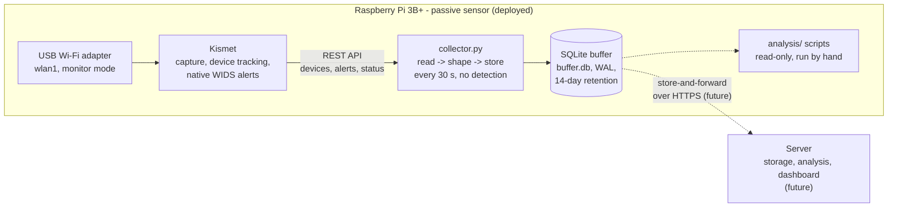

# Findings so far (thesis topic proposal)

Headline numbers measured on the running sensor, collated from the three
read-only analysis scripts in `analysis/`. Nothing here is recomputed: every
figure is copied from the script output of one run on **2026-09-19, 12:32-12:35
UTC**, over **3.9 days** of capture (2026-09-15 13:53 -> 2026-09-19 12:34 UTC).
Re-running the scripts later will shift the values as data accumulates.
Sections 1-4 predate the data gaps listed in section 6; any later re-run must
account for them (e.g. exclude the gap from coverage and rate figures).
Section 7 lists sensor configuration changes that alter what is captured (e.g.
the channel-hop list, 2026-09-26): compare per-channel figures only within one
configuration period. Section 8 is the probe-request feasibility study.

| Script | Invocation |
|---|---|
| `analyze.py` | `python3 /opt/wifi-sensor/analysis/analyze.py --utc` |
| `rssi_stability.py` | `python3 /opt/wifi-sensor/analysis/rssi_stability.py --no-table` (defaults: >= 200 readings on >= 2 days) |
| `inventory_changes.py` | `python3 /opt/wifi-sensor/analysis/inventory_changes.py --protected IK-WIFI,FRI_wifi` (defaults: 24 h baseline, close = median RSSI >= -60 dBm) |

## 1. Dataset (`analyze.py`)

| | |
|---|---|
| Capture span | 3 d 22 h 39 m (3.94 days) |
| Polls | 11 210 total, 11 196 ok, 14 failed; **98.6 % coverage** at the 30 s interval |
| Gaps > 90 s | 3 (total 1 h 16 m, largest 1 h 02 m, on the first day) |
| Poll duration | avg 434 ms, max 4 467 ms |
| Devices ever seen | 28 546 (26 987 clients, 1 226 bridged, **312 APs**, 20 other, 1 ad-hoc) |
| Observations (RSSI time series) | 870 257 rows, ~223 000 per day |
| AP configuration changes | 20 209 history rows over 146 devices (almost all `adv_channel`/`ht_mode`/`beacon_rate` churn; `crypt` changed 36 times, `ssid` 239) |
| Kismet WIDS alerts | 19 (12 NOCLIENTMFP, 2 DEAUTHFLOOD, 1 BEACONRATE, 4 datasource open/error) |
| Probe requests | 20 476 client x SSID rows from 18 979 clients; 360 distinct named SSIDs |
| Buffer on disk | 152 MB, growing ~39 MB/day -> ~545 MB steady state at 14-day retention |

## 2. RSSI baseline stability (`rssi_stability.py`)

Across **106 fixed APs** with enough readings (>= 200 readings on >= 2 days;
690 131 readings):

| Metric (one value per AP) | Median | Q3 | p90 |
|---|---|---|---|
| RSSI standard deviation | **2.3 dB** | 3.3 dB | 5.2 dB |
| Robust sd (MAD-based) | 1.5 dB | 3.0 dB | 3.0 dB |
| Day-to-day range of the daily mean | 2.4 dB | 3.9 dB | 6.2 dB |

| APs whose RSSI sd is within | 2 dB | **3 dB** | **5 dB** | 8 dB |
|---|---|---|---|---|
| plain sd | 45 (42 %) | **71 (67 %)** | **92 (87 %)** | 102 (96 %) |
| robust sd | 65 (61 %) | 99 (93 %) | 99 (93 %) | 104 (98 %) |

- By band: 5 GHz is steadier (median sd 1.9 dB, 98 % of APs <= 5 dB) than
  2.4 GHz (median sd 2.5 dB, 80 % <= 5 dB).
- Drift vs. within-day noise: median day-to-day range of the mean / median
  robust sd = **1.61** - the script's own reading: a ratio well below ~2 means one
  static baseline per AP is adequate.
- Caveats (from the script): `rssi` is Kismet's `sig_last` (one frame per poll,
  not an average); readings exist only for polls in which the AP was active;
  phone hotspots that moved are not filtered beyond the min-days rule.

## 3. False-positive floor of a naive RSSI threshold (`rssi_stability.py`)

Baseline = median of the first 50 % of each AP's readings; evaluated on the
remaining **345 090 genuine readings** of the same 106 APs. The share of readings
a rule `|reading - baseline| > Y dB` would flag **with no attack present**:

| Y | Readings flagged (pooled) | Median AP | Worst AP | Excursions | Excursions lasting >= 3 obs. | APs never flagged |
|---|---|---|---|---|---|---|
| 3 dB | 23.99 % | 15.3 % | 71.6 % | 30 752 | 6 018 | 1 / 106 |
| 5 dB | 9.14 % | 2.6 % | 65.6 % | 14 394 | 2 323 | 3 / 106 |
| 6 dB | 5.79 % | 1.1 % | 64.4 % | 9 574 | 1 616 | 3 / 106 |
| 8 dB | 2.03 % | 0.28 % | 60.6 % | 4 855 | 393 | 14 / 106 |
| 10 dB | 0.97 % | 0.06 % | 59.0 % | 2 317 | 147 | 31 / 106 |
| 12 dB | 0.72 % | 0.01 % | 58.2 % | 1 602 | 128 | 53 / 106 |
| 15 dB | 0.63 % | 0.00 % | 56.9 % | 1 321 | 121 | 70 / 106 |
| 20 dB | 0.13 % | 0.00 % | 14.1 % | 359 | 17 | 81 / 106 |

- Size of genuine deviations: p50 2 dB, p90 5 dB, p95 7 dB, **p99 10 dB**,
  p99.9 22 dB, max 53 dB.
- A per-AP `3 x robust sigma` rule flags **8.06 %** of genuine readings
  (median threshold 4.4 dB).
- The worst-AP column is dominated by weak, far-away phone hotspots
  (baseline around -106 dBm, at the noise floor); the campus APs that make the top-10 list sit at 7-15 %
  beyond 8 dB.
- Conclusion the numbers support: a single fixed dB threshold on `sig_last` has
  a false-positive floor of roughly 1-2 % of readings even at 8-10 dB, and
  excursions of several consecutive observations are common - any RSSI-based
  detector needs per-AP baselines and persistence, not a global threshold.

## 4. AP inventory and impostor candidates (`inventory_changes.py`)

**312 AP devices** in 3 d 22 h (115 hidden SSID, 98 randomised BSSID).

| | Count | Transient | Intermediate | Sustained |
|---|---|---|---|---|
| APs first seen in the 24 h baseline window | 185 | 50 (27 %) | 2 (1 %) | 133 (72 %) |
| APs first seen after the baseline window | 127 | 101 (80 %) | 16 (13 %) | 10 (8 %) |

- Raw churn: **40 new APs per day** (mean over the 2 full post-baseline days),
  of which 84 % transient and 0.5/day sustained; 40-73 % of each post-baseline day's new
  BSSIDs are randomised (hotspots).
- Persistence x strength of the 127 newcomers: **0** in the "sustained + close
  (>= -60 dBm)" cell, the only population a stationary sensor could act on.
- Protected SSID `IK-WIFI`: 62 BSSIDs, all Ruckus Wireless (OUI `EC:58:EA` x60,
  `3C:46:A1` x2), **62 first seen in the baseline, 0 later**; flags raised:
  crypt x29, strong x14, oui x2, dropped x2.
- Protected SSID `FRI_wifi`: 2 BSSIDs (Routerboard), no flags.
- Look-alike SSIDs: none. (59 sustained APs have a hidden SSID and cannot be
  matched.)
- **Candidate list: 39** = 39 flagged protected-SSID BSSIDs + 0 look-alikes +
  0 sustained close newcomers; by class: sustained/far 38, transient/far 1.

Assessment (manual reading of the candidate table, not a script output): all 39
candidates are Ruckus BSSIDs of the campus infrastructure that were present in
the baseline window. The `crypt` flags come from the prefix `IK-WIFI` grouping
the open guest SSID with `IK-WIFI-DOT1X` (WPA2-EAP), and the `strong` flags are
simply the nearest APs of the same infrastructure. **No organic rogue AP occurred
in the capture** - so the inventory signal is clean, but it also cannot be
evaluated on real positives yet.

## 5. Architecture

```mermaid
flowchart LR
    subgraph pi["Raspberry Pi 3B+ - passive sensor (deployed)"]
        adapter["USB Wi-Fi adapter<br/>wlan1, monitor mode"]
        kismet["Kismet<br/>capture, device tracking,<br/>native WIDS alerts"]
        collector["collector.py<br/>read -> shape -> store<br/>every 30 s, no detection"]
        buffer[("SQLite buffer<br/>buffer.db, WAL,<br/>14-day retention")]
        analysis["analysis/ scripts<br/>read-only, run by hand"]
        adapter --> kismet
        kismet -- "REST API<br/>devices, alerts, status" --> collector
        collector --> buffer
        buffer -.-> analysis
    end
    server["Server<br/>storage, analysis, dashboard<br/>(future)"]
    buffer -. "store-and-forward<br/>over HTTPS (future)" .-> server
```

## 6. Known data gaps

Windows in which the buffer has no usable polls, or in which polls succeeded
but the capture delivered no frames (Kismet's packet counter frozen). Exclude
them from coverage, rate and "never seen" statements, and do not schedule staged
experiments into them. Windows with reduced channel coverage (but frames) are
in section 7.

| From (UTC) | To (UTC) | Length | Cause |
|---|---|---|---|
| 2026-09-22 13:43:21 (last ok poll) | 2026-09-23 09:26:58 (first ok poll) | 19 h 44 m | Root filesystem full (Kismet logs) |
| 2026-09-26 22:46:43 (last ok poll) | 2026-09-26 22:48:23 (first ok poll) | 1 m 40 s | Controlled reboot after the hop-list/journal install (`sudo reboot` 22:46:55, Kismet up 22:47:52; one failed poll at 22:47:53) |
| 2026-09-27 11:30:14 (source "re-opened" after a capture-helper crash; counter frozen from the 11:29:54 poll) | 2026-09-27 11:34:25 (watchdog restarted Kismet; frames again at the 11:34:54 poll) | ~4 m | Polls ok, no frames: helper crashes at 11:29:37 and 11:30:07, Kismet's re-open with the broken definition (section 7) captured nothing until the watchdog's second strike |
| 2026-09-27 12:17:20 (helper crash; counter frozen from the 12:17:24 poll) | 2026-09-27 12:22:55 (watchdog restarted Kismet; frames again at the 12:23:24 poll) | ~5.5 m | Same: helper crashes at 12:17:20/39/47, re-open captured nothing |

**2026-09-22 disk-full gap** (boundaries read from `polls` in the live buffer):

- Cause: 11 GB of kismetdb logs in `/var/lib/kismet` (79 files, 69 of them empty)
  filled the 15 GB root filesystem. Each file was ~93 % logged frames (~1.5 GB/day),
  which nothing on the sensor reads.
- Kismet's own log stopped growing at 12:19:57 (its writes failed first); the
  collector kept polling until 13:43:21, then there are no rows at all until
  20:01:57.
- 20:01:57-20:29:27: 56 failed polls (`ok = 0`, connection refused) while Kismet
  crash-looped every ~6 s, leaving one empty `.kismet` file per attempt.
- From 20:29 the collector itself crash-looped (>1500 restarts) on
  `sqlite3.OperationalError: disk I/O error` at `PRAGMA journal_mode=WAL` and
  wrote nothing until the disk was freed on 2026-09-23.
- No data loss before the gap: the buffer passed `PRAGMA quick_check` after WAL
  replay (a copy taken during the outage; opening the main file without its WAL
  showed it as malformed, so the `-wal` file must never be deleted by hand).
- Fixes (`install_sensor.sh`): no frame logging in kismetdb, idle-device expiry in
  Kismet's tracker, the kismetdb log retention timer, a journald size cap - see
  `CLAUDE.md`, "Disk-full incident".

## 7. Sensor configuration changes (dataset boundaries)

Changes to the sensor that alter what is captured. Figures that depend on the
channel coverage (per-channel counts, probe rates, "never seen on channel X")
must not be compared across these boundaries without saying so. Times are UTC,
read from the running system after the change (journal, `polls`), not planned.

| Effective from (UTC) | Change | Effect on the data |
|---|---|---|
| 2026-09-26 22:45:26 | Hop list: explicit `channels=` list, Kismet's autodetected 91-entry list without `165HT40-` (90 entries, same order, shuffled at 5 hops/s). `install_sensor.sh` restarted Kismet at 22:45:25-26; last poll on the old list 22:45:13, first on the new list 22:45:43 | rtw88 WARN storm over (last WARN 22:45:22; 0 since); the 721 ms stall per cycle is gone (dwell median 0.215 s, max 0.223 s). **But only 45 of the 90 entries were visited, until 2026-09-27 13:04:57** (stride 4 vs length 90, see below): **WIDS and any probe data from 2026-09-26 22:45:26 to 2026-09-27 13:04:57 saw half the channel list** - and most of that window even less (next row) |
| 2026-09-26 23:09:14 - 2026-09-27 11:34:24, and 2026-09-27 12:17:20 - 12:22:55 | **Hop list collapsed to channel 1** after capture-helper crashes ("IPC connection closed" at 23:09:14, 23:29:21, 23:54:22, 00:11:05, 11:29:37, 11:30:07, 12:17:20/39/47). Kismet 2025-09 re-opens a failed source from a definition it rebuilds without quoting (`kis_datasource.cc`, `generate_source_definition()`), so `channels="1,1HT40+,..."` became `channels=1` plus stray options; the re-opened source hopped `['1']` (saved datasource state of both Kismet runs; the first reboot-to-11:34 run logged 6 retries, the 11:34-12:22 run 3). Ended only by the watchdog's Kismet restarts (stuck counter after the later crashes) | **Only 2412 MHz received for ~12 h 25 min overnight and ~5 min at noon**: from the 23:10 10-minute bin to 11:20 every observation in the buffer is on 2412 MHz (a few 2417-2457 MHz values until 23:40 from adjacent-channel reception), no 5 GHz at all; the frame rate stayed normal, so the watchdog did not notice. Treat these windows as channel-1-only data. Plus no frames at all 11:30:14-11:34:25 and 12:17:20-12:22:55 (section 6). Caused by the explicit `channels=` list of 22:45:26 - with Kismet's autodetected list (no commas in the definition) a re-open kept the full list |
| 2026-09-27 13:04:57 | Hop list: 89 entries (also without `140HT40-`, 136+140 is not an 802.11 40 MHz channel; same order otherwise), stride check in the installer. `install_sensor.sh` restarted Kismet 13:04:56-57; last poll on the 90-entry list 13:04:54, first on the 89-entry list 13:05:24 | Full coverage again: all **89** distinct settings visited (`dwell_poll.py`, 90 s at ~13:21), stride 4, gcd(89, 4) = 1; dwell median 0.215 s, max 0.222 s; cycle ~19.1 s; 2.4 GHz time share 19.5 %; 0 WARNs. **Still exposed to the channel-1 collapse at the next helper crash** (open item in `CLAUDE.md`) - check future data for 2412-only stretches |
| 2026-09-27 13:04:57 | Kismet web UI / REST API bound to 127.0.0.1 (`httpd_bind_address`; was 0.0.0.0 on every interface). The existing web UI login was **kept** (unique password, not reused elsewhere; now reachable only on loopback / through an SSH tunnel) | None on the captured data (the collector already used 127.0.0.1; polls continued) |
| 2026-09-26 ~22:40 | Journal persistent (`journalctl --flush` during the install; the oldest entry kept from that boot is 22:40:39) | Kernel, Kismet and collector logs survive reboots (200 MB cap). Earlier incidents have only ~4 min of journal. Each boot's first lines carry the stale clock (e.g. 2026-09-15 13:53) until chrony syncs - the pre-start logs "clock synchronised" at that point |

**Hop coverage before and after 22:45:26** (measured with
`analysis/probe_study/dwell_poll.py`):

| | Before (2026-09-26 ~22:20, 90 s) | 90 entries (~22:52, 90 s; 22:59, 20 s) | 89 entries (2026-09-27 ~13:21, 90 s) |
|---|---|---|---|
| Hop-list entries | 91 | 90 | 89 |
| Distinct settings visited | 91 | **45** (every other list position) | 89 |
| Dwell per hop | median 0.215 s; `165HT40-` 0.721 s | median 0.215 s, max 0.223 s | median 0.215 s, max 0.222 s |
| Full cycle | ~20.1 s | ~9.7 s (45 x 0.215 s) | ~19.1 s |
| 2.4 GHz time share | 18.2 % | 19.7 % (20 s sample) | 19.5 % |
| Channel 165 airtime | ~4.6 % (165 + 165HT40-, incl. stall) | 0 % (`165` is not visited) | ~1.1 % (`165` only) |

Why only half: the capture helper steps through the (shuffled) list with a fixed
stride that Kismet 2025-09 derives from the list length alone - the Linux Wi-Fi
helper prefers 4 (`capture_linux_wifi.c`) and `cf_handler_assign_hop_channels`
(`capture_framework.c`) keeps the first s >= 4 with `N % (N / s) != 0`, which is
not a coprimality test. For N = 91 that is 4, coprime with 91 (all visited, by
luck); for N = 90 it is also 4, gcd(90, 4) = 2, so only even list positions are
tuned.
Not visited since 22:45:26: 2.4 GHz `1HT40+`, 3, 5, `6HT40-`, 7, 9, 11 (20 MHz;
11 is still the primary of `11HT40-`), 12; on 5 GHz every odd position (e.g. 36,
`36VHT80`, `40HT40-`, 44, `44VHT80`, ..., 165). Adjacent-channel reception on
2.4 GHz still hears some frames of the skipped channels. This period ended at
2026-09-27 13:04:57 (89-entry list, row above); most of it was channel-1-only
anyway (row "Hop list collapsed"). No channel reweighting was done - that is a
separate, later decision for the probe study.

## 8. Probe-request feasibility study (2026-09-26)

Question: can this sensor (Pi 3B+, one RTL8821CU on `rtw88_8821cu`, Kismet
2025-09-R1, channel hopping) passively fingerprint Wi-Fi clients and re-link
probe-request bursts of devices that randomise their MAC, from frame features
(probe-request IEs, 802.11 sequence numbers, timing, RSSI)? Scripts:
`analysis/probe_study/`. Sample: **2026-09-26 22:01-22:16 UTC (Saturday night)**,
15 min on the old 91-entry hop list (before section 7): 53,232 frames,
**355 probe requests from 157 MACs**. All captures lived in tmpfs on the Pi and
were deleted; MACs/SSIDs were only handled as keyed hashes with a per-run key;
everything below is aggregate. **Night-time, one location, 15 minutes: repeat at
the daytime peak before drawing conclusions.**

### Capture paths (verified in the 2025-09-R1 source and live)

| Path | Result |
|---|---|
| REST pcapng stream `GET /datasource/pcap/by-uuid/<uuid>/packets.pcapng` (`datasourcetracker.cc`), also `/pcap/all_packets.pcapng` | **Used.** Read-only role, basic auth. Full frames, linktype 127 (radiotap). Filterable only per datasource, device key or BSSID - not by frame type, so every frame is streamed (probe requests were 0.67 %). Fed at the packet-chain logging stage; drops silently when its 512 KB backlog is full (no counter) |
| Eventbus websocket `/eventbus/events` | Nothing per frame: `NEW_DEVICE`, `DOT11_NEW_PROBED_SSID` (once per new device+SSID), `PACKETCHAIN_STATS`, `ALERT`, `DATASOURCE_*`, `TIMESTAMP`, `MESSAGE`. `/devices/monitor` is per device |
| Direct capture beside Kismet on `wlan1mon` | Needs root: no tcpdump/tshark/dumpcap/scapy installed, the sensor user has no capabilities (only `kismet_cap_linux_wifi` has `cap_net_admin,cap_net_raw`) |
| Kismet's `dot11.device.probe_fingerprint` | Per MAC, last value only (Adler-32 over IEs 1, 50, 59, 107, 127, two vendor IEs) - useless across randomised MACs |

**Cross-check, Kismet stream vs raw socket** (`raw_vs_kismet.py`, run by the
developer with sudo on 2026-09-26 at night, before the hop-list change at
22:44): 5 min, **58/58 probe requests on both** the raw AF_PACKET socket (kernel
BPF filter) and the Kismet stream, **0 kernel drops** on the raw socket. CPU:
Kismet-stream thread ~2.68 s vs raw-socket thread 0.09 s over 300 s (the stream
parses every frame; the BPF passes only probe requests). The 15-min sample's
stream delivered ~98 % of the frames the datasource counter advanced by in the
same window (a 60 s re-run on 2026-09-26 23:00: 98.6 %); the 58/58 result shows
that this gap did not cost probe requests in that window.

### Feature availability

| Feature | Status | Evidence |
|---|---|---|
| Full probe frames + radiotap without root | Available | REST stream, 100 % of frames with radiotap |
| dBm signal | Available | 2 fields per frame (combined + antenna 0); median -67 dBm, p10/p90 -92/-46 |
| TSFT | Available | 100 % of frames, monotonic, all distinct |
| Channel, Flags, Rate, RX flags | Available | Flags always 0x10 (FCS appended); no MCS/VHT/HE fields (probes use legacy rates) |
| Bad-FCS / drop visibility | Partial | FCS-failed frames are dropped in the kernel (`fcsfail` off): 0 bad frames seen. Stream has no drop counter; `wlan1mon`: 5 of 443k dropped, 0 transmitted |
| True transmit channel | Partial | Radiotap gives the tuned channel. On 2.4 GHz 58 % of probes with a DS Parameter IE were heard from another channel (off by 1: 96, same: 79); the DS Parameter IE is in only 54 % of frames |
| IE set/order fingerprint | Partial (low entropy) | 67 content fingerprints over frames, 38 over MACs; 3.3 bits over MACs (max possible 7.3); randomised MACs only 2.9 bits, largest group 54 % of them. Rate IEs differ by band, so fingerprints must be per band |
| Sequence number within a MAC | Available | consecutive frames: 126 +1..16, 38 +17..256, 26 larger, 8 backwards |
| Sequence number across a MAC change | Not available | first seq of new randomised MACs uniform (median 2151; 8 < 256 vs 9.2 by chance); nearest same-fingerprint successor within 10 s: 0 of 82 within +64 (1.3 by chance) - reset/randomised on MAC change |
| Directed vs wildcard | Available, strong linker | 217 directed, 138 wildcard, 10 distinct SSIDs; 96 of 147 randomised MACs sent directed probes |
| Burst structure | Partial | 214 bursts: 72 % one frame, 88 % on one channel; 118 of 157 MACs seen once |
| WPS UUID-E | Absent | 0 frames |

Example: 91 randomised MACs (106 frames, 2.4 GHz only, median -50 dBm) share one
IE fingerprint and one directed SSID (89 % of their frames) - almost certainly
one nearby device changing its MAC on every scan and trivially re-linkable.

### Rates and coverage

- 24.1 probe requests/min (5-52 per minute), 14.5 bursts/min; 93.6 % of MACs
  but 65.9 % of frames randomised; 10 global MACs sent 34 % of frames.
- Collector buffer, 2026-09-23..25 (`buffer_hourly.py`): ~6,500 new probing
  MACs/day, 99.6 % randomised, most at 00-04 UTC - MAC-per-scan devices, not
  people. (09-23 starts at 09:27 after the disk-full gap.)
- Hop list then: 91 entries at 5/s, dwell 0.215 s, cycle ~20 s. Time share vs
  probe yield: 2.4 GHz 18.2 % of listen time -> 63 % of probes (partly
  off-channel); 5 GHz 36-48 13.2 % -> 9.6 %; DFS 52-144 52.7 % -> 13.5 %;
  149-165 15.4 % -> 13.5 %.
- A phone scan visits each channel for tens of ms; estimated chance of catching
  a given scan ~0.3-0.45 (not measured), usually with one frame. Continuous
  multi-day observation compensates - the planned ablation (continuous vs
  one-shot) rests on this.

### Cost on the Pi (15-min sample)

Kismet 7.6 % of one core while streaming (5.9 % lifetime average, +1.7 points),
RSS +1 MB; the consumer 0.7 % and 10 MB; loopback stream ~10 KB/s; system 5.9 %
of 4 cores. Storage: raw probe frames average 179 B (~6 MB/day at the night
rate); compact per-probe records ~2-3 MB/day; budget <= 10 MB/day for peaks.

### Risks

1. Most randomised MACs send one frame - fingerprints from 1-2 frames.
2. Sequence-number linkage is not available on this population.
3. Low IE entropy (~3 bits): linkage has to rest on directed SSIDs, RSSI and
   timing; daytime samples may spread the classes.
4. Hopping misses most scan bursts; capture-helper restarts (~13/day before the
   storm fix) add gaps, and with an explicit hop list each one currently pins the
   sensor to channel 1 until Kismet restarts (section 7; 2026-09-26 22:45 -
   2026-09-27 13:05 also had only half the channels).
5. Weak sample (15 min, night, one site, dominated by one device).
6. Data protection: keyed hashes are still pseudonymous personal data and
   directed SSIDs are sensitive - an ethics/GDPR note is needed.
